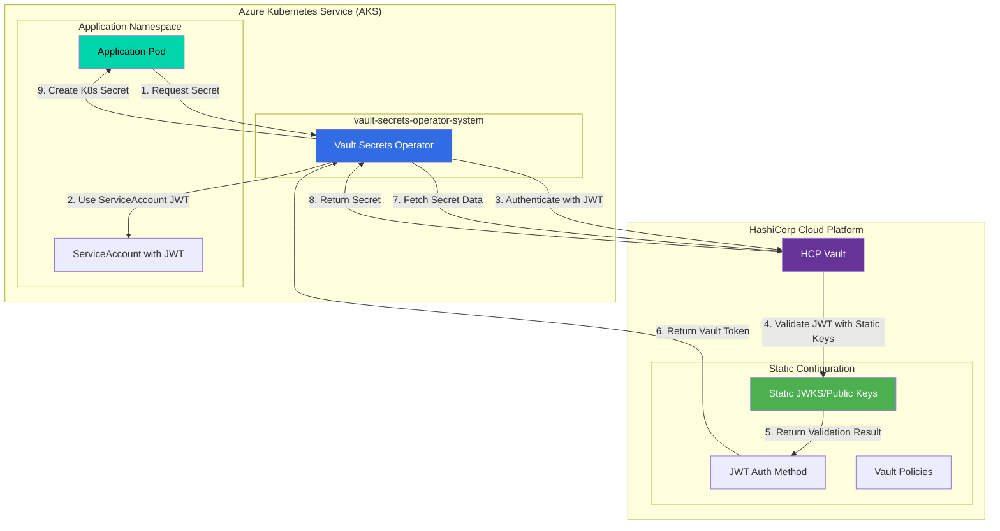

# Manual OIDC Configuration for AKS-HCP Vault Integration

## Overview

You can configure HCP Vault's JWT authentication method with **static OIDC metadata** instead of using automatic discovery. This approach eliminates **all network calls** from HCP Vault to your AKS cluster.

## Benefits of Manual Configuration

✅ **Zero callbacks** - No network calls from HCP Vault to AKS  
✅ **Complete isolation** - HCP Vault works independently  
✅ **Air-gapped support** - Works with private/isolated clusters  
✅ **Deterministic behavior** - No dependency on AKS API availability  
✅ **Enhanced security** - No outbound connections required  

## Manual Configuration Methods

### Method 1: Static JWKS Configuration

Instead of using `oidc_discovery_url`, provide the JWKS data directly:

```bash
# Step 1: Extract JWKS from your AKS cluster
JWKS_DATA=$(curl -k https://your-aks-cluster/.well-known/openid_configuration | jq -r '.jwks_uri' | xargs curl -k)

# Step 2: Configure JWT auth with static JWKS
vault auth enable -path=kubernetes-jwt jwt

vault write auth/kubernetes-jwt/config \
    jwks="$JWKS_DATA" \
    bound_issuer="https://kubernetes.default.svc.cluster.local"
```

### Method 2: Public Key Configuration

Provide RSA public keys directly:

```bash
# Step 1: Extract public key from AKS cluster
kubectl get --raw /openid/v1/jwks | jq -r '.keys[0]' > aks-public-key.json

# Step 2: Convert JWKS to PEM format
# Use a tool like https://github.com/chanced/jwks-to-pem or:
cat aks-public-key.json | jq -r 'select(.kty=="RSA") | {n,e}' | jwks-to-pem > aks-public-key.pem

# Step 3: Configure Vault with static public key
vault write auth/kubernetes-jwt/config \
    jwt_validation_pubkeys=@aks-public-key.pem \
    bound_issuer="https://kubernetes.default.svc.cluster.local"
```

### Method 3: Complete Manual Configuration

Manually specify all OIDC parameters:

```bash
vault write auth/kubernetes-jwt/config \
    jwt_validation_pubkeys=@aks-public-key.pem \
    jwt_supported_algs="RS256" \
    bound_issuer="https://kubernetes.default.svc.cluster.local" \
    bound_audiences="vault"
```

## Step-by-Step Implementation Guide

### Step 1: Extract AKS OIDC Metadata

Create a script to extract all necessary information from your AKS cluster:

```bash
#!/bin/bash
# extract-aks-oidc-metadata.sh

set -euo pipefail

echo "Extracting AKS OIDC metadata for manual configuration..."

# Get cluster API server
CLUSTER_URL=$(kubectl config view --minify --output jsonpath='{.clusters[0].cluster.server}')
echo "Cluster URL: $CLUSTER_URL"

# Get OIDC discovery document
echo "Fetching OIDC discovery document..."
OIDC_CONFIG=$(curl -k "${CLUSTER_URL}/.well-known/openid_configuration")
echo "$OIDC_CONFIG" | jq . > oidc-config.json

# Extract issuer
ISSUER=$(echo "$OIDC_CONFIG" | jq -r '.issuer')
echo "Issuer: $ISSUER"

# Get JWKS URI
JWKS_URI=$(echo "$OIDC_CONFIG" | jq -r '.jwks_uri')
echo "JWKS URI: $JWKS_URI"

# Fetch JWKS data
echo "Fetching JWKS data..."
JWKS_DATA=$(curl -k "$JWKS_URI")
echo "$JWKS_DATA" | jq . > jwks.json

# Extract supported algorithms
ALGORITHMS=$(echo "$OIDC_CONFIG" | jq -r '.id_token_signing_alg_values_supported[]' | tr '\n' ',' | sed 's/,$//')
echo "Supported algorithms: $ALGORITHMS"

# Generate Vault configuration
cat > vault-jwt-config.sh << EOF
#!/bin/bash
# Generated Vault JWT configuration

# Enable JWT auth method
vault auth enable -path=kubernetes-jwt jwt

# Configure with static JWKS
vault write auth/kubernetes-jwt/config \\
    jwks='$JWKS_DATA' \\
    jwt_supported_algs="$ALGORITHMS" \\
    bound_issuer="$ISSUER"

echo "Manual OIDC configuration completed!"
EOF

chmod +x vault-jwt-config.sh

echo ""
echo "✅ AKS OIDC metadata extracted successfully!"
echo "Files created:"
echo "  - oidc-config.json     (OIDC discovery document)"
echo "  - jwks.json           (JSON Web Key Set)"
echo "  - vault-jwt-config.sh (Vault configuration script)"
echo ""
echo "Run './vault-jwt-config.sh' to configure HCP Vault"
```

### Step 2: Configure HCP Vault

Run the generated configuration:

```bash
# Extract metadata from AKS (one-time)
./extract-aks-oidc-metadata.sh

# Configure HCP Vault with static metadata
./vault-jwt-config.sh
```

### Step 3: Create JWT Roles

```bash
# Create role for webapp ServiceAccount
vault write auth/kubernetes-jwt/role/webapp \
    role_type="jwt" \
    bound_audiences="vault" \
    bound_subject="system:serviceaccount:production:webapp" \
    bound_claims='{"kubernetes.io/namespace":"production"}' \
    user_claim="sub" \
    policies="webapp-policy" \
    ttl=1h \
    max_ttl=4h
```

## Advanced Manual Configuration Options

### Multi-Key Support

For clusters with key rotation, provide multiple public keys:

```bash
# Combine multiple public keys
cat key1.pem key2.pem key3.pem > combined-keys.pem

vault write auth/kubernetes-jwt/config \
    jwt_validation_pubkeys=@combined-keys.pem \
    bound_issuer="https://kubernetes.default.svc.cluster.local"
```

### Algorithm Specification

Explicitly specify supported algorithms:

```bash
vault write auth/kubernetes-jwt/config \
    jwt_validation_pubkeys=@aks-public-keys.pem \
    jwt_supported_algs="RS256,RS384,RS512" \
    bound_issuer="https://kubernetes.default.svc.cluster.local"
```

### Custom Issuer Validation

Support custom issuers for different AKS configurations:

```bash
# For AKS with Azure AD integration
vault write auth/kubernetes-jwt/config \
    jwt_validation_pubkeys=@aks-public-keys.pem \
    bound_issuer="https://sts.windows.net/your-tenant-id/"

# For AKS with Workload Identity
vault write auth/kubernetes-jwt/config \
    jwt_validation_pubkeys=@aks-public-keys.pem \
    bound_issuer="https://eastus.oic.prod-aks.azure.com/tenant-id/issuer-id/"
```

## Key Rotation Management

### Manual Key Rotation Process

When AKS rotates signing keys, update Vault configuration:

```bash
#!/bin/bash
# rotate-aks-keys.sh

echo "Rotating AKS signing keys in Vault..."

# Fetch updated JWKS
NEW_JWKS=$(curl -k https://your-aks-cluster/openid/v1/jwks)

# Update Vault configuration
vault write auth/kubernetes-jwt/config \
    jwks="$NEW_JWKS" \
    bound_issuer="https://kubernetes.default.svc.cluster.local"

echo "✅ Keys rotated successfully"
```

### Automated Key Rotation

Set up a periodic job to check for key rotation:

```bash
#!/bin/bash
# automated-key-rotation.sh

CURRENT_JWKS=$(vault read -field=jwks auth/kubernetes-jwt/config)
NEW_JWKS=$(curl -k https://your-aks-cluster/openid/v1/jwks)

if [ "$CURRENT_JWKS" != "$NEW_JWKS" ]; then
    echo "Key rotation detected, updating Vault..."
    vault write auth/kubernetes-jwt/config \
        jwks="$NEW_JWKS" \
        bound_issuer="https://kubernetes.default.svc.cluster.local"
    echo "✅ Keys updated"
else
    echo "No key rotation needed"
fi
```

## Network Architecture with Manual Configuration



## Comparison: Automatic vs Manual OIDC Configuration

| Aspect | Automatic Discovery | Manual Configuration |
|--------|-------------------|---------------------|
| **Network Calls** | Initial + periodic refresh | Zero during runtime |
| **Setup Complexity** | Simple (one command) | Moderate (extract + configure) |
| **Key Rotation** | Automatic | Manual process required |
| **Air-gap Support** | No | Yes |
| **Network Isolation** | Requires connectivity | Complete isolation |
| **Maintenance** | Low | Medium (key rotation) |
| **Security** | Good | Excellent (no network deps) |

## Security Considerations

### Key Management

1. **Secure key extraction**: Use secure methods to extract JWKS from AKS
2. **Key storage**: Store public keys securely in Vault configuration
3. **Key rotation**: Implement regular key rotation procedures
4. **Key validation**: Verify key integrity before configuration

### Network Isolation

```bash
# With manual configuration, HCP Vault requires NO network access to AKS
# Only outbound connections for secret retrieval are needed

# Network policy example (if using network policies)
apiVersion: networking.k8s.io/v1
kind: NetworkPolicy
metadata:
  name: vault-secrets-operator
spec:
  podSelector:
    matchLabels:
      app: vault-secrets-operator
  policyTypes:
  - Egress
  egress:
  - to: []  # Allow outbound to HCP Vault only
    ports:
    - protocol: TCP
      port: 8200
```

## Troubleshooting Manual Configuration

### Common Issues

1. **Invalid JWKS format**
```bash
# Validate JWKS format
cat jwks.json | jq '.keys[] | {kty, use, alg, kid}'
```

2. **Key algorithm mismatch**
```bash
# Check supported algorithms
vault read auth/kubernetes-jwt/config | grep jwt_supported_algs
```

3. **Issuer validation failure**
```bash
# Verify JWT token issuer
kubectl create token webapp --audience=vault -n production | jwt decode -
```

## Migration from Automatic to Manual

```bash
#!/bin/bash
# migrate-to-manual-config.sh

echo "Migrating from automatic to manual OIDC configuration..."

# 1. Extract current configuration
CURRENT_ISSUER=$(vault read -field=bound_issuer auth/kubernetes-jwt/config)
CURRENT_DISCOVERY_URL=$(vault read -field=oidc_discovery_url auth/kubernetes-jwt/config)

# 2. Fetch JWKS from discovery URL
JWKS_URI=$(curl -k "${CURRENT_DISCOVERY_URL}/.well-known/openid_configuration" | jq -r '.jwks_uri')
JWKS_DATA=$(curl -k "$JWKS_URI")

# 3. Reconfigure with static JWKS
vault write auth/kubernetes-jwt/config \
    jwks="$JWKS_DATA" \
    bound_issuer="$CURRENT_ISSUER" \
    oidc_discovery_url=""  # Clear automatic discovery

echo "✅ Migration to manual configuration completed"
echo "HCP Vault will no longer make calls to AKS for OIDC metadata"
```

## Conclusion

Manual OIDC configuration provides **complete network isolation** between HCP Vault and your AKS cluster while maintaining all security benefits of JWT authentication. This approach is ideal for:

- Air-gapped environments
- Highly secure deployments
- Environments with strict network policies
- Scenarios requiring zero network dependencies

The trade-off is slightly increased operational complexity for key rotation, but this can be automated with proper tooling.