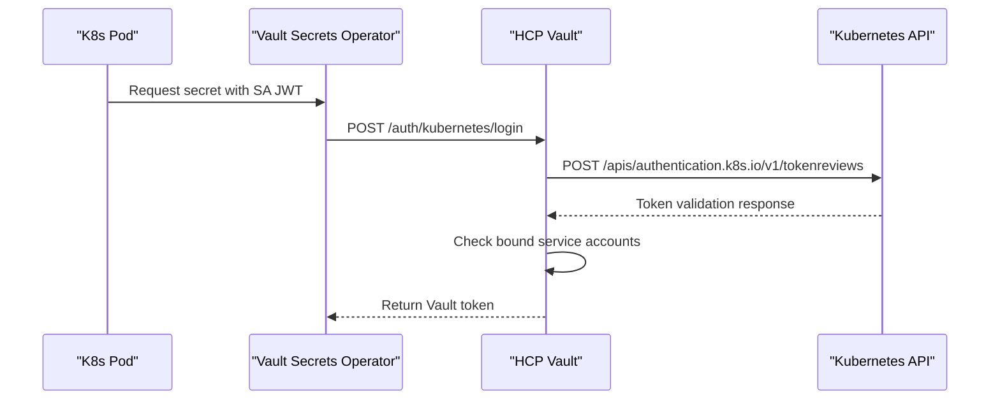
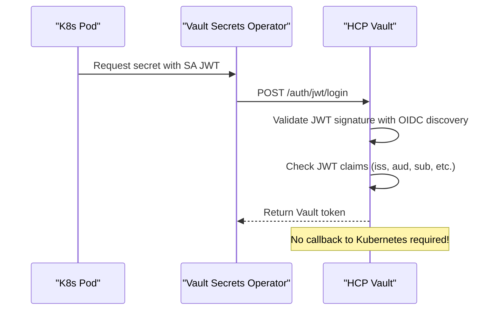

# OIDC/JWT Authentication for Kubernetes ServiceAccount Tokens with HCP Vault

## Overview

Yes, HCP Vault can validate Kubernetes ServiceAccount JWT tokens directly using **OIDC/JWT authentication** without requiring callbacks to the Kubernetes API server. This approach eliminates the need for the TokenReview API and provides several advantages over the traditional Kubernetes auth method.

## Comparison: TokenReview vs OIDC/JWT

### Current TokenReview Method


### OIDC/JWT Method (Recommended)


## Benefits of OIDC/JWT Authentication

### 1. **No Network Dependencies**
- Eliminates the need for HCP Vault to call back to Kubernetes API
- Reduces network complexity and potential failure points
- Works even if Kubernetes API is temporarily unavailable

### 2. **Better Performance**
- Faster authentication (no external API calls)
- Lower latency for secret retrieval
- Reduced load on Kubernetes API server

### 3. **Enhanced Security**
- Cryptographic validation using OIDC discovery
- No need for special ServiceAccounts in Kubernetes
- Standard JWT validation practices

### 4. **Simplified Architecture**
- No `vault-auth` ServiceAccount required
- No `system:auth-delegator` RBAC needed
- Cleaner network policies

## Implementation Guide

### Step 1: Enable OIDC Discovery in Kubernetes

Modern Kubernetes clusters (1.21+) expose OIDC discovery endpoints by default:

```bash
# Check if OIDC discovery is available
kubectl get --raw /.well-known/openid_configuration

# Example response shows OIDC endpoints
{
  "issuer": "https://kubernetes.default.svc.cluster.local",
  "jwks_uri": "https://kubernetes.default.svc.cluster.local/openid/v1/jwks",
  "response_types_supported": ["id_token"],
  "subject_types_supported": ["public"],
  "id_token_signing_alg_values_supported": ["RS256"]
}
```

### Step 2: Configure JWT Auth Method in HCP Vault

```bash
# Enable JWT auth method
vault auth enable -path=kubernetes-jwt jwt

# Configure OIDC discovery
vault write auth/kubernetes-jwt/config \
    oidc_discovery_url="https://your-aks-cluster.hcp.azure.com" \
    oidc_discovery_ca_pem="$KUBERNETES_CA_CERT" \
    bound_issuer="https://kubernetes.default.svc.cluster.local"
```

### Step 3: Create JWT Roles

```bash
# Create role for webapp ServiceAccount
vault write auth/kubernetes-jwt/role/webapp \
    role_type="jwt" \
    bound_audiences="vault" \
    bound_subject="system:serviceaccount:production:webapp" \
    bound_claims='{"kubernetes.io/namespace":"production"}' \
    user_claim="sub" \
    policies="webapp-policy" \
    ttl=1h \
    max_ttl=4h

# Create role for platform services
vault write auth/kubernetes-jwt/role/platform \
    role_type="jwt" \
    bound_audiences="vault" \
    bound_subject="system:serviceaccount:platform:platform-service" \
    bound_claims='{"kubernetes.io/namespace":"platform"}' \
    user_claim="sub" \
    policies="platform-policy" \
    ttl=2h \
    max_ttl=8h
```

### Step 4: Configure ServiceAccount Tokens

#### For Kubernetes 1.21+
ServiceAccount tokens are automatically bound with the correct audience:

```yaml
apiVersion: v1
kind: ServiceAccount
metadata:
  name: webapp
  namespace: production
---
# Token is automatically created with audience binding
```

#### For Explicit Token Binding
```yaml
apiVersion: v1
kind: Secret
metadata:
  name: webapp-vault-token
  namespace: production
  annotations:
    kubernetes.io/service-account.name: webapp
type: kubernetes.io/service-account-token
data:
  # Token will be automatically populated
  # with audience: vault
```

### Step 5: Update Vault Secrets Operator Configuration

```yaml
apiVersion: secrets.hashicorp.com/v1beta1
kind: VaultAuth
metadata:
  name: webapp-auth
  namespace: production
spec:
  method: jwt
  mount: kubernetes-jwt
  jwt:
    role: webapp
    serviceAccount: webapp
    audiences:
      - vault
---
apiVersion: secrets.hashicorp.com/v1beta1
kind: VaultConnection
metadata:
  name: vault-connection
  namespace: production
spec:
  address: https://your-vault-cluster.vault.hashicorp.cloud:8200
  skipTLSVerify: false
```

### Step 6: Application Deployment

```yaml
apiVersion: apps/v1
kind: Deployment
metadata:
  name: webapp
  namespace: production
spec:
  template:
    spec:
      serviceAccountName: webapp
      containers:
      - name: webapp
        image: webapp:latest
        # VSO will automatically inject secrets
        volumeMounts:
        - name: secrets
          mountPath: /vault/secrets
          readOnly: true
      volumes:
      - name: secrets
        csi:
          driver: secrets-store.csi.k8s.io
          readOnly: true
          volumeAttributes:
            secretProviderClass: webapp-secrets
```

## Advanced Configuration

### Multi-Cluster Support

For multiple AKS clusters using the same HCP Vault:

```bash
# Cluster-specific roles
vault write auth/kubernetes-jwt/role/webapp-cluster1 \
    role_type="jwt" \
    bound_audiences="vault" \
    bound_subject="system:serviceaccount:production:webapp" \
    bound_claims='{"kubernetes.io/namespace":"production","iss":"https://cluster1.example.com"}' \
    policies="webapp-policy"

vault write auth/kubernetes-jwt/role/webapp-cluster2 \
    role_type="jwt" \
    bound_audiences="vault" \
    bound_subject="system:serviceaccount:production:webapp" \
    bound_claims='{"kubernetes.io/namespace":"production","iss":"https://cluster2.example.com"}' \
    policies="webapp-policy"
```

### Dynamic Role Binding

```bash
# Use templated policies for multi-team scenarios
vault write auth/kubernetes-jwt/role/team-template \
    role_type="jwt" \
    bound_audiences="vault" \
    bound_claims='{"kubernetes.io/namespace":"{{identity.entity.aliases.auth_kubernetes_jwt_xxx.metadata.namespace}}"}' \
    user_claim="sub" \
    policies="team-{{identity.entity.aliases.auth_kubernetes_jwt_xxx.metadata.namespace}}-policy"
```

## Security Considerations

### 1. **Audience Validation**
Always specify `bound_audiences` to prevent token reuse:

```bash
bound_audiences="vault,my-service"
```

### 2. **Issuer Validation**
Use `bound_issuer` to ensure tokens come from trusted clusters:

```bash
bound_issuer="https://kubernetes.default.svc.cluster.local"
```

### 3. **Claims Validation**
Validate critical claims to prevent privilege escalation:

```bash
bound_claims='{"kubernetes.io/namespace":"production","kubernetes.io/pod.name":"webapp-*"}'
```

### 4. **Token TTL**
Configure appropriate token lifetimes:

```bash
ttl=1h          # Regular operation
max_ttl=4h      # Maximum extension
```

## Migration from TokenReview to OIDC/JWT

### Migration Script

```bash
#!/bin/bash
# migrate-to-jwt-auth.sh

echo "Migrating from Kubernetes auth to JWT auth..."

# 1. Enable JWT auth method
vault auth enable -path=kubernetes-jwt jwt

# 2. Configure OIDC discovery
CLUSTER_URL=$(kubectl config view --raw --minify --flatten -o jsonpath='{.clusters[].cluster.server}')
CLUSTER_CA=$(kubectl config view --raw --minify --flatten -o jsonpath='{.clusters[].cluster.certificate-authority-data}' | base64 -d)

vault write auth/kubernetes-jwt/config \
    oidc_discovery_url="$CLUSTER_URL" \
    oidc_discovery_ca_pem="$CLUSTER_CA" \
    bound_issuer="https://kubernetes.default.svc.cluster.local"

# 3. Migrate existing roles
vault list auth/kubernetes/role | while read role; do
    if [[ "$role" != "Keys" ]]; then
        echo "Migrating role: $role"
        
        # Get existing role configuration
        BOUND_SA=$(vault read -field=bound_service_account_names auth/kubernetes/role/$role)
        BOUND_NS=$(vault read -field=bound_service_account_namespaces auth/kubernetes/role/$role)
        POLICIES=$(vault read -field=policies auth/kubernetes/role/$role)
        TTL=$(vault read -field=ttl auth/kubernetes/role/$role)
        MAX_TTL=$(vault read -field=max_ttl auth/kubernetes/role/$role)
        
        # Create equivalent JWT role
        vault write auth/kubernetes-jwt/role/$role \
            role_type="jwt" \
            bound_audiences="vault" \
            bound_subject="system:serviceaccount:$BOUND_NS:$BOUND_SA" \
            bound_claims="{\"kubernetes.io/namespace\":\"$BOUND_NS\"}" \
            user_claim="sub" \
            policies="$POLICIES" \
            ttl="$TTL" \
            max_ttl="$MAX_TTL"
    fi
done

echo "Migration complete! Update your VaultAuth resources to use mount: kubernetes-jwt"
```

### Update VaultAuth Resources

```bash
# Update existing VaultAuth resources
kubectl get vaultauth -A -o yaml | \
sed 's/method: kubernetes/method: jwt/' | \
sed 's/mount: kubernetes/mount: kubernetes-jwt/' | \
kubectl apply -f -
```

## Troubleshooting

### Common Issues

1. **OIDC Discovery Failed**
```bash
# Check if discovery endpoint is accessible
curl -k https://your-cluster-url/.well-known/openid_configuration
```

2. **JWT Validation Failed**
```bash
# Verify JWT claims
kubectl create token webapp --audience=vault -n production | jwt decode -
```

3. **Audience Mismatch**
```bash
# Check token audience
kubectl get secret webapp-token -o jsonpath='{.data.token}' | base64 -d | jwt decode -
```

## Conclusion

OIDC/JWT authentication provides a more robust, performant, and secure method for Kubernetes-Vault integration compared to the TokenReview approach. It eliminates network dependencies, improves performance, and follows standard JWT validation practices while maintaining the same security guarantees.

The migration is straightforward and can be done gradually, allowing you to test the new authentication method alongside the existing TokenReview approach before fully switching over.