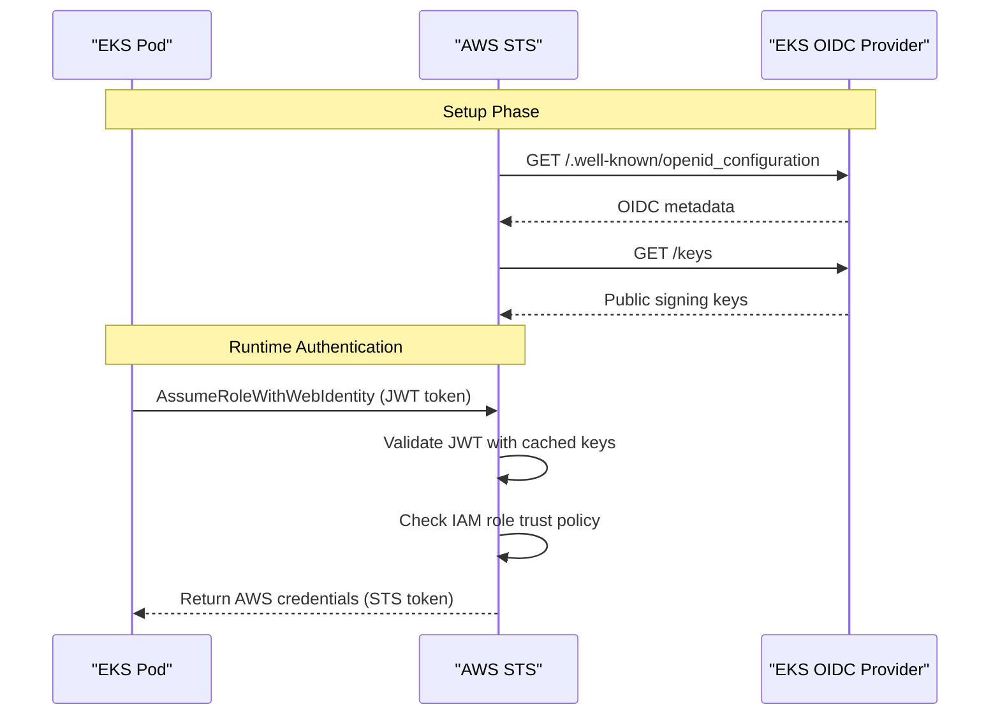
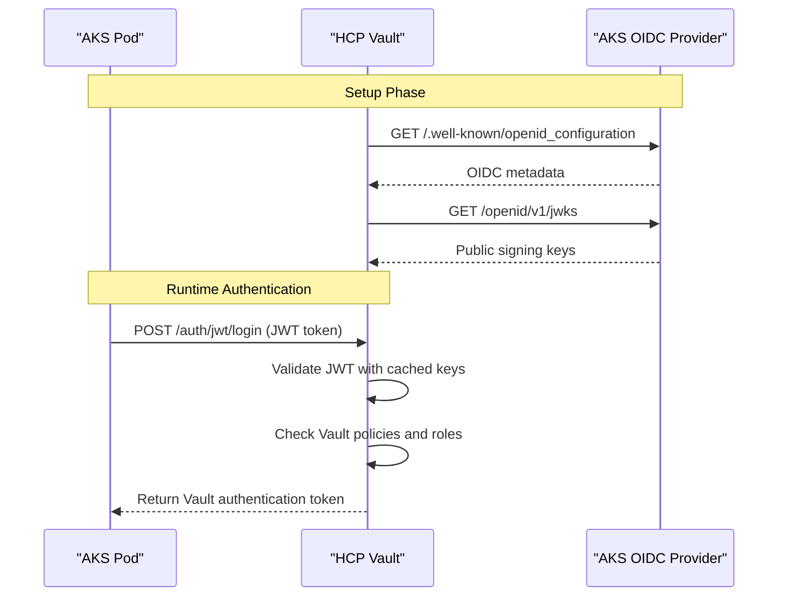

# AWS IRSA vs AKS OIDC/JWT Authentication Comparison

## Overview

Yes! **AWS IRSA (IAM Roles for Service Accounts)** uses the exact same OIDC/JWT authentication mechanism that we've been discussing for AKS. Both leverage Kubernetes ServiceAccount JWT tokens validated through OIDC discovery.

## Core Similarities

Both AWS IRSA and AKS OIDC/JWT authentication share:

✅ **ServiceAccount JWT tokens** - Kubernetes-issued JWT tokens with claims  
✅ **OIDC discovery** - Identity provider metadata and public keys  
✅ **Cryptographic validation** - JWT signature verification using public keys  
✅ **No TokenReview callbacks** - Direct JWT validation without K8s API calls  
✅ **Manual configuration support** - Static OIDC metadata configuration  

## Architecture Comparison

### AWS IRSA Flow



### AKS OIDC/JWT Flow (with HCP Vault)



## Technical Implementation Comparison

### AWS IRSA Configuration

#### EKS Cluster Setup
```bash
# EKS automatically creates OIDC identity provider
# OIDC issuer URL: https://oidc.eks.region.amazonaws.com/id/CLUSTER_ID

# Create IAM role with trust policy
cat > trust-policy.json << EOF
{
  "Version": "2012-10-17",
  "Statement": [
    {
      "Effect": "Allow",
      "Principal": {
        "Federated": "arn:aws:iam::ACCOUNT:oidc-provider/oidc.eks.region.amazonaws.com/id/CLUSTER_ID"
      },
      "Action": "sts:AssumeRoleWithWebIdentity",
      "Condition": {
        "StringEquals": {
          "oidc.eks.region.amazonaws.com/id/CLUSTER_ID:sub": "system:serviceaccount:namespace:service-account",
          "oidc.eks.region.amazonaws.com/id/CLUSTER_ID:aud": "sts.amazonaws.com"
        }
      }
    }
  ]
}
EOF

aws iam create-role --role-name my-role --assume-role-policy-document file://trust-policy.json
```

#### ServiceAccount Annotation
```yaml
apiVersion: v1
kind: ServiceAccount
metadata:
  name: my-service-account
  namespace: my-namespace
  annotations:
    eks.amazonaws.com/role-arn: arn:aws:iam::ACCOUNT:role/my-role
```

### AKS OIDC/JWT Configuration (with HCP Vault)

#### HCP Vault Setup
```bash
# Configure JWT auth method
vault write auth/kubernetes-jwt/config \
    oidc_discovery_url="https://my-aks-cluster.hcp.eastus.azmk8s.io:443" \
    bound_issuer="https://kubernetes.default.svc.cluster.local"

# Create Vault role
vault write auth/kubernetes-jwt/role/my-role \
    role_type="jwt" \
    bound_audiences="vault" \
    bound_subject="system:serviceaccount:my-namespace:my-service-account" \
    bound_claims='{"kubernetes.io/namespace":"my-namespace"}' \
    policies="my-policy"
```

#### ServiceAccount Configuration
```yaml
apiVersion: v1
kind: ServiceAccount
metadata:
  name: my-service-account
  namespace: my-namespace
  # No special annotations needed for Vault
```

## OIDC Discovery Endpoints Comparison

### AWS EKS OIDC Endpoints
```bash
# OIDC Discovery
curl https://oidc.eks.us-west-2.amazonaws.com/id/CLUSTER_ID/.well-known/openid_configuration

# JWKS Endpoint  
curl https://oidc.eks.us-west-2.amazonaws.com/id/CLUSTER_ID/keys
```

**Example Response:**
```json
{
  "issuer": "https://oidc.eks.us-west-2.amazonaws.com/id/CLUSTER_ID",
  "jwks_uri": "https://oidc.eks.us-west-2.amazonaws.com/id/CLUSTER_ID/keys",
  "authorization_endpoint": "urn:kubernetes:programmatic_authorization",
  "response_types_supported": ["id_token"],
  "subject_types_supported": ["public"],
  "claims_supported": ["sub", "iss"],
  "id_token_signing_alg_values_supported": ["RS256"]
}
```

### AKS OIDC Endpoints
```bash
# OIDC Discovery
curl https://my-aks-cluster.hcp.eastus.azmk8s.io/.well-known/openid_configuration

# JWKS Endpoint
curl https://my-aks-cluster.hcp.eastus.azmk8s.io/openid/v1/jwks
```

**Example Response:**
```json
{
  "issuer": "https://kubernetes.default.svc.cluster.local",
  "jwks_uri": "https://my-aks-cluster.hcp.eastus.azmk8s.io/openid/v1/jwks",
  "response_types_supported": ["id_token"],
  "subject_types_supported": ["public"],
  "id_token_signing_alg_values_supported": ["RS256"],
  "claims_supported": ["aud", "exp", "iat", "iss", "kubernetes.io", "nbf", "sub"]
}
```

## JWT Token Claims Comparison

### AWS IRSA JWT Claims
```json
{
  "aud": ["sts.amazonaws.com"],
  "exp": 1640995200,
  "iat": 1640991600,
  "iss": "https://oidc.eks.us-west-2.amazonaws.com/id/CLUSTER_ID",
  "kubernetes.io": {
    "namespace": "my-namespace",
    "pod": {
      "name": "my-pod-12345",
      "uid": "pod-uid-12345"
    },
    "serviceaccount": {
      "name": "my-service-account",
      "uid": "sa-uid-12345"
    }
  },
  "nbf": 1640991600,
  "sub": "system:serviceaccount:my-namespace:my-service-account"
}
```

### AKS JWT Claims (for Vault)
```json
{
  "aud": ["vault"],
  "exp": 1640995200,
  "iat": 1640991600,
  "iss": "https://kubernetes.default.svc.cluster.local",
  "kubernetes.io/namespace": "my-namespace",
  "kubernetes.io/pod/name": "my-pod-12345",
  "kubernetes.io/pod/uid": "pod-uid-12345",
  "kubernetes.io/serviceaccount/name": "my-service-account",
  "kubernetes.io/serviceaccount/uid": "sa-uid-12345",
  "nbf": 1640991600,
  "sub": "system:serviceaccount:my-namespace:my-service-account"
}
```

## Manual Configuration Support

Both AWS and AKS support manual OIDC configuration without automatic discovery.

### AWS Manual IRSA Configuration

```bash
# Manually configure AWS IAM OIDC provider
aws iam create-open-id-connect-provider \
    --url https://oidc.eks.us-west-2.amazonaws.com/id/CLUSTER_ID \
    --thumbprint-list 9e99a48a9960b14926bb7f3b02e22da2b0ab7280 \
    --client-id-list sts.amazonaws.com
```

### AKS Manual Configuration (HCP Vault)

```bash
# Extract and configure static JWKS
JWKS_DATA=$(curl -k https://my-aks-cluster/openid/v1/jwks)

vault write auth/kubernetes-jwt/config \
    jwks="$JWKS_DATA" \
    bound_issuer="https://kubernetes.default.svc.cluster.local"
```

## Network Connectivity Patterns

### AWS IRSA Network Flow
```mermaid
graph LR
    subgraph "EKS Cluster"
        Pod[Pod with IRSA]
    end
    
    subgraph "AWS Services"
        STS[AWS STS]
        OIDC[EKS OIDC Provider]
    end
    
    Pod -->|1. AssumeRoleWithWebIdentity| STS
    STS -->|2. Validate JWT (if needed)| OIDC
    STS -->|3. Return AWS credentials| Pod
```

### AKS + HCP Vault Network Flow
```mermaid
graph LR
    subgraph "AKS Cluster"
        Pod[Pod with SA]
    end
    
    subgraph "HCP Vault"
        Vault[Vault Server]
    end
    
    subgraph "AKS OIDC"
        OIDC[OIDC Provider]
    end
    
    Pod -->|1. JWT Authentication| Vault
    Vault -->|2. Validate JWT (setup only)| OIDC
    Vault -->|3. Return Vault token| Pod
```

## Key Differences

| Aspect | AWS IRSA | AKS + HCP Vault |
|--------|----------|-----------------|
| **Identity Provider** | AWS manages EKS OIDC | AKS exposes OIDC endpoints |
| **Token Exchange** | JWT → AWS STS credentials | JWT → Vault authentication token |
| **Trust Relationship** | IAM role trust policy | Vault JWT role configuration |
| **Audience** | `sts.amazonaws.com` | `vault` (configurable) |
| **Issuer** | EKS-specific URL | `kubernetes.default.svc.cluster.local` |
| **Key Rotation** | AWS handles automatically | Manual or periodic refresh |
| **Network Calls** | AWS STS validates internally | HCP Vault validates internally |

## Use Cases Comparison

### When to Use AWS IRSA
- **AWS-native services** (S3, RDS, etc.)
- **AWS SDK integration** required
- **AWS IAM policies** for authorization
- **EKS-only deployments**

### When to Use AKS + HCP Vault
- **Multi-cloud deployments** (AWS, Azure, GCP)
- **HashiCorp ecosystem** integration
- **Dynamic secrets** (databases, cloud providers)
- **Centralized secrets management**
- **Complex policy management**

## Migration Patterns

### From AWS IRSA to HCP Vault

```yaml
# Before: AWS IRSA
apiVersion: v1
kind: ServiceAccount
metadata:
  annotations:
    eks.amazonaws.com/role-arn: arn:aws:iam::123456789012:role/my-role

# After: HCP Vault
apiVersion: v1
kind: ServiceAccount
metadata:
  name: my-service-account
  # No annotations needed

---
apiVersion: secrets.hashicorp.com/v1beta1
kind: VaultAuth
metadata:
  name: my-auth
spec:
  method: jwt
  mount: kubernetes-jwt
  jwt:
    role: my-role
    serviceAccount: my-service-account
    audiences: ["vault"]
```

### Supporting Both Patterns

```yaml
# Hybrid approach: Support both AWS IRSA and Vault
apiVersion: v1
kind: ServiceAccount
metadata:
  name: my-service-account
  annotations:
    eks.amazonaws.com/role-arn: arn:aws:iam::123456789012:role/my-role
    vault.hashicorp.com/role: my-vault-role
```

## Best Practices

### Security Considerations

1. **Audience Binding**
   - AWS: Always use `sts.amazonaws.com`
   - Vault: Use specific audiences like `vault`

2. **Subject Validation**
   - Both: Validate `sub` claim matches expected ServiceAccount

3. **Namespace Isolation**
   - Both: Include namespace in trust/role policies

4. **Token TTL**
   - AWS: STS token TTL (default 1 hour)
   - Vault: Configurable token TTL

### Operational Considerations

1. **Key Rotation**
   - AWS: Automatic via EKS
   - Vault: Manual or automated refresh needed

2. **Monitoring**
   - AWS: CloudTrail for STS calls
   - Vault: Audit logs for authentication

3. **Troubleshooting**
   - Both: JWT token claims validation
   - Both: Network connectivity verification

## Conclusion

**AWS IRSA and AKS OIDC/JWT authentication are fundamentally the same technology:**

✅ **Same JWT mechanism** - ServiceAccount tokens with OIDC validation  
✅ **Same network patterns** - Setup calls + runtime validation  
✅ **Same manual config support** - Static OIDC metadata configuration  
✅ **Same security model** - Cryptographic JWT validation  

**Key difference:** AWS IRSA exchanges JWT for AWS credentials, while AKS+Vault exchanges JWT for Vault authentication tokens.

Both eliminate the need for TokenReview API callbacks and provide the same performance and security benefits through direct JWT validation.