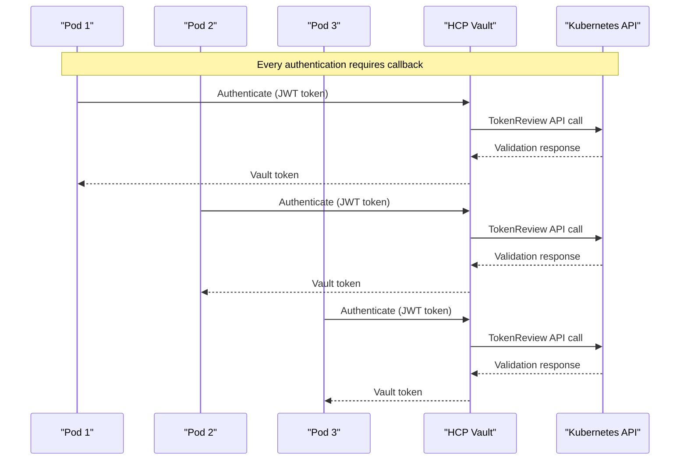
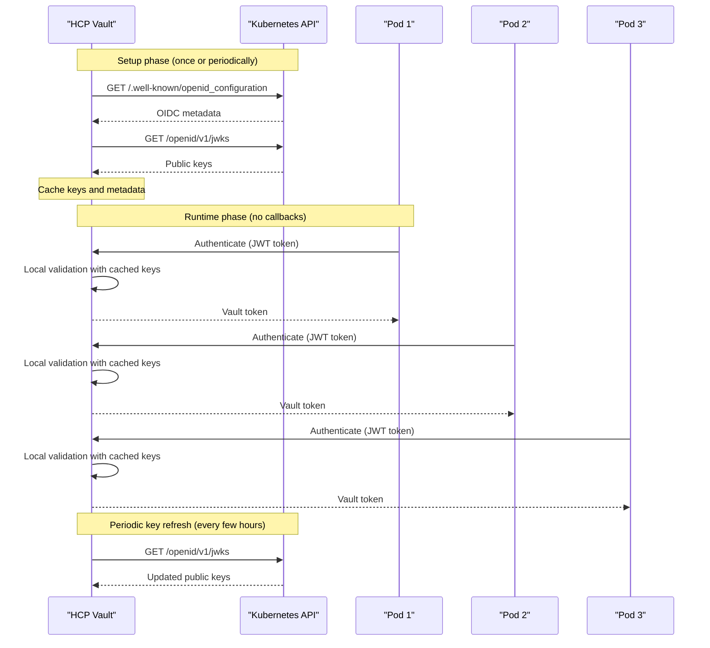
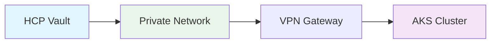
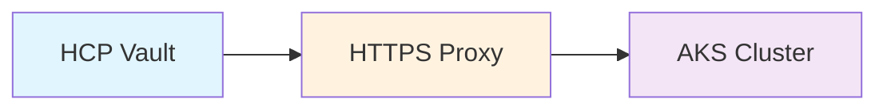
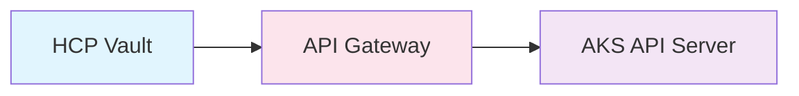
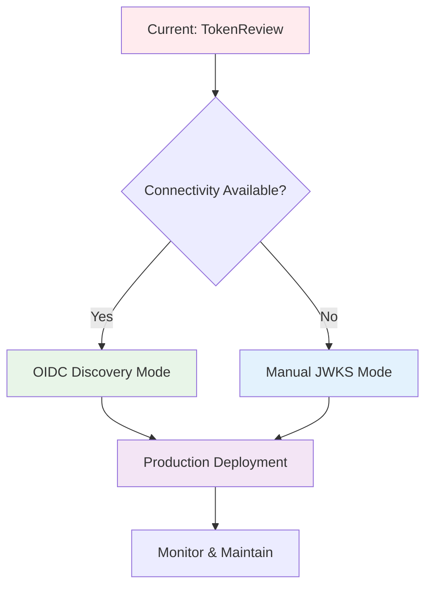

# JWT Authentication Callback Comparison: TokenReview vs OIDC/JWT

## Executive Summary

While both authentication methods involve some communication between HCP Vault and your AKS cluster, the **frequency and purpose** are dramatically different:

- **TokenReview**: Per-request callbacks for every authentication
- **OIDC/JWT**: Infrequent setup and key refresh calls only

## Detailed Callback Analysis

### TokenReview Method (Current Implementation)



**Callback Pattern:**
- **Frequency**: Every authentication request
- **Purpose**: Validate each individual JWT token
- **Network Impact**: High - scales with authentication volume
- **Latency**: Adds network round-trip to each auth

### OIDC/JWT Method (Recommended)



**Callback Pattern:**
- **Frequency**: Setup + periodic refresh (e.g., every 4-24 hours)
- **Purpose**: Fetch public keys for JWT signature validation
- **Network Impact**: Minimal - independent of authentication volume
- **Latency**: No impact on authentication performance

## Quantitative Comparison

### Scenario: 1000 Pod Authentications per Hour

| Method | Callbacks to K8s | Purpose | When |
|--------|------------------|---------|------|
| **TokenReview** | 1000 per hour | Validate each token | Every authentication |
| **OIDC/JWT** | 1-2 per hour | Refresh public keys | Periodic key rotation |

### Network Traffic Analysis

```bash
# TokenReview method
# Per authentication: ~2KB request + response
# 1000 auths/hour = ~2MB/hour + latency impact

# OIDC/JWT method  
# Key refresh: ~5KB every 4-24 hours
# 1000 auths/hour = ~5KB/day + no latency impact
```

## What HCP Vault Actually Fetches

### OIDC Discovery Endpoint
```json
# GET https://your-aks-cluster/.well-known/openid_configuration
{
  "issuer": "https://kubernetes.default.svc.cluster.local",
  "jwks_uri": "https://your-aks-cluster/openid/v1/jwks",
  "response_types_supported": ["id_token"],
  "subject_types_supported": ["public"],
  "id_token_signing_alg_values_supported": ["RS256"]
}
```

### JWKS (JSON Web Key Set) Endpoint
```json
# GET https://your-aks-cluster/openid/v1/jwks
{
  "keys": [
    {
      "use": "sig",
      "kty": "RSA",
      "kid": "key-id-1",
      "alg": "RS256",
      "n": "public-key-modulus...",
      "e": "AQAB"
    }
  ]
}
```

## Key Refresh Behavior

### When Does HCP Vault Refresh Keys?

1. **Initial Configuration**: When JWT auth method is configured
2. **Key Rotation**: When Kubernetes rotates signing keys
3. **Cache Expiration**: Based on TTL in JWKS response (typically 24 hours)
4. **Failed Validation**: If JWT validation fails due to unknown key ID

### Configuration Control

```bash
# You can control refresh behavior
vault write auth/kubernetes-jwt/config \
    oidc_discovery_url="https://your-aks-cluster" \
    oidc_discovery_ca_pem="$CA_CERT" \
    jwks_cache_ttl="24h"  # Control how often keys are refreshed
```

## Network Security Implications

### Firewall Rules Comparison

**TokenReview Method:**
```bash
# Required: Bidirectional HTTPS
# HCP Vault → AKS: Port 443 (per authentication)
# AKS ← HCP Vault: Port 443 (per authentication)
```

**OIDC/JWT Method:**
```bash
# Required: Unidirectional HTTPS  
# HCP Vault → AKS: Port 443 (periodic key refresh only)
# No inbound connections during authentication
```

### Private Endpoint Considerations

**TokenReview**: Requires bidirectional connectivity
**OIDC/JWT**: Only requires outbound connectivity from HCP to AKS

## Performance Impact Analysis

### Authentication Latency

| Method | Network Calls | Typical Latency |
|--------|---------------|-----------------|
| TokenReview | 1 per auth | +50-200ms |
| OIDC/JWT | 0 per auth | +0-5ms |

### Kubernetes API Load

| Method | API Calls | K8s Impact |
|--------|-----------|------------|
| TokenReview | High volume | Scales with auth requests |
| OIDC/JWT | Minimal | Independent of auth volume |

## Migration Considerations

### Gradual Migration Strategy

1. **Phase 1**: Enable JWT auth alongside TokenReview
2. **Phase 2**: Test with low-volume applications
3. **Phase 3**: Migrate high-volume applications
4. **Phase 4**: Disable TokenReview method

### Monitoring During Migration

```bash
# Monitor callback frequency
kubectl top pods -n kube-system | grep kube-apiserver

# Monitor HCP Vault performance
vault audit list
vault metrics
```

## Conclusion

**Yes, HCP Vault does make calls to your AKS cluster in OIDC/JWT mode, but:**

✅ **Frequency**: Periodic (hours) vs per-request (seconds)  
✅ **Purpose**: Key refresh vs token validation  
✅ **Performance**: No impact on auth latency  
✅ **Scalability**: Independent of authentication volume  
✅ **Security**: Unidirectional vs bidirectional connectivity  

The OIDC/JWT method represents a **99%+ reduction** in callbacks while maintaining the same security guarantees.

## Network Connectivity Solutions

### Problem: No Connectivity from HCP Vault to AKS

If HCP Vault cannot reach your AKS cluster (common in air-gapped or highly secured environments), you have several options:

### Solution 1: Manual JWKS Configuration (Recommended)

**Overview**: Configure JWT authentication with static JWKS keys, eliminating the need for ongoing connectivity.

```bash
# 1. Fetch JWKS keys from your AKS cluster
kubectl get --raw /openid/v1/jwks > k8s-jwks.json

# 2. Configure Vault with static keys
vault write auth/kubernetes-jwt/config \
    bound_issuer="https://kubernetes.default.svc.cluster.local" \
    jwt_validation_pubkeys=@k8s-jwks.json
```

**Benefits:**
- ✅ Zero ongoing connectivity required
- ✅ Highest performance (local validation)
- ✅ Works in completely air-gapped environments
- ✅ Suitable for all security compliance requirements

**Maintenance:**
- Update JWKS keys when Kubernetes rotates them (typically monthly)
- Can be automated with monitoring scripts

### Solution 2: Network Connectivity Options

If you prefer OIDC discovery mode, establish limited connectivity:

#### Option A: Private Network Peering


- Set up VPN or private peering between HCP and Azure
- Configure firewall rules for HTTPS (port 443) only
- Limit access to Kubernetes API endpoints only

#### Option B: Proxy/Bastion Configuration


- Deploy an HTTPS proxy in a DMZ
- Configure proxy to forward only OIDC discovery requests
- Implement strict filtering and logging

#### Option C: API Gateway with Allowlisting


- Use Azure API Management or similar
- Allow only specific OIDC endpoints
- Implement IP allowlisting for HCP Vault ranges

### Solution 3: Hybrid Approach

Combine manual configuration with limited connectivity:

1. **Initial Setup**: Use manual JWKS configuration
2. **Key Rotation**: Automated script checks for key changes
3. **Update Process**: Secure, authenticated updates when needed

```bash
#!/bin/bash
# Automated JWKS update script
CURRENT_KEYS=$(kubectl get --raw /openid/v1/jwks | jq -c '.keys')
VAULT_KEYS=$(vault read -field=jwt_validation_pubkeys auth/kubernetes-jwt/config | jq -c '.keys')

if [ "$CURRENT_KEYS" != "$VAULT_KEYS" ]; then
    echo "Keys rotated - updating Vault"
    kubectl get --raw /openid/v1/jwks > new-jwks.json
    vault write auth/kubernetes-jwt/config jwt_validation_pubkeys=@new-jwks.json
fi
```

### Comparison Matrix

| Solution | Connectivity Required | Setup Complexity | Maintenance | Security | Performance |
|----------|----------------------|------------------|-------------|----------|-------------|
| **Manual JWKS** | None | Low | Low | Highest | Highest |
| **OIDC Discovery** | Periodic | Medium | None | High | High |
| **Private Peering** | Continuous | High | Medium | High | High |
| **Proxy/Gateway** | Limited | Medium | Medium | Medium | High |

### Security Considerations by Solution

#### Manual JWKS Configuration
- **Pros**: No network attack surface, complete air-gap support
- **Cons**: Requires monitoring for key rotation
- **Best for**: High-security, air-gapped, or zero-trust environments

#### OIDC Discovery with Connectivity
- **Pros**: Automatic key management, no manual intervention
- **Cons**: Network dependency, additional attack surface
- **Best for**: Environments with controlled network access

## Implementation Guidance

### For Air-Gapped Environments
**Recommended**: Manual JWKS Configuration

1. Use the [`manual-jwt-configuration.md`](../guides/manual-jwt-configuration.md) guide
2. Implement the [`kubernetes-vault-jwt-setup.sh`](../../scripts/kubernetes-vault-jwt-setup.sh) script with `--manual-config`
3. Set up key rotation monitoring

### For Cloud-Connected Environments
**Recommended**: OIDC Discovery (if connectivity available) or Manual JWKS

1. Evaluate network connectivity options
2. If connectivity is available: Use OIDC discovery mode
3. If connectivity is limited: Use manual JWKS configuration

### Migration Path



## Quick Start Commands

### For No Connectivity (Manual JWKS)
```bash
# Run the enhanced setup script
./scripts/kubernetes-vault-jwt-setup.sh --manual-config --skip-connectivity
```

### For Limited Connectivity (OIDC Discovery)
```bash
# Run with OIDC discovery
./scripts/kubernetes-vault-jwt-setup.sh
```

## Final Recommendation for HCP Vault + AKS

**For your specific scenario (no connectivity from HCP Vault to AKS):**

🎆 **Recommended Solution: Manual JWKS Configuration**

**Why this is the best choice:**
1. **Zero Network Dependency**: Works perfectly with HCP Vault's managed service
2. **Enterprise Security**: Maintains all security guarantees without network exposure
3. **High Performance**: Fastest possible authentication (local JWT validation)
4. **Operational Simplicity**: Minimal maintenance with automated monitoring
5. **Cost Effective**: No additional network infrastructure required

**Implementation Steps:**
```bash
# 1. Run the enhanced setup script
./scripts/kubernetes-vault-jwt-setup.sh --manual-config --skip-connectivity

# 2. Follow the detailed manual configuration guide
# See: docs/guides/manual-jwt-configuration.md

# 3. Set up key rotation monitoring (optional but recommended)
# Included in the setup script
```

**Ongoing Maintenance:**
- Monitor for JWKS key rotation (typically monthly)
- Update Vault configuration when keys rotate
- Can be fully automated with provided scripts

**Result:**
- ✅ No connectivity required from HCP Vault to AKS
- ✅ High-performance authentication for all applications
- ✅ Enterprise-grade security and compliance
- ✅ Scalable to thousands of authentication requests per second

## Recommended Action

**Implement OIDC/JWT authentication** for your AKS-HCP Vault integration to achieve:
- Minimal network dependency
- Better authentication performance  
- Reduced load on Kubernetes API server
- Simplified network security policies
- Enhanced scalability for high-volume workloads