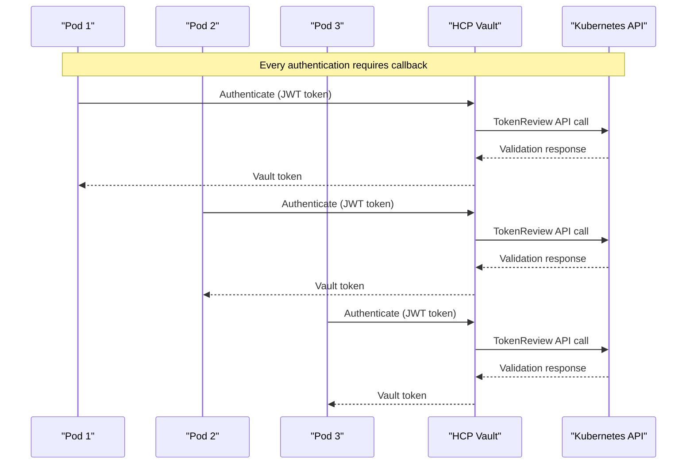
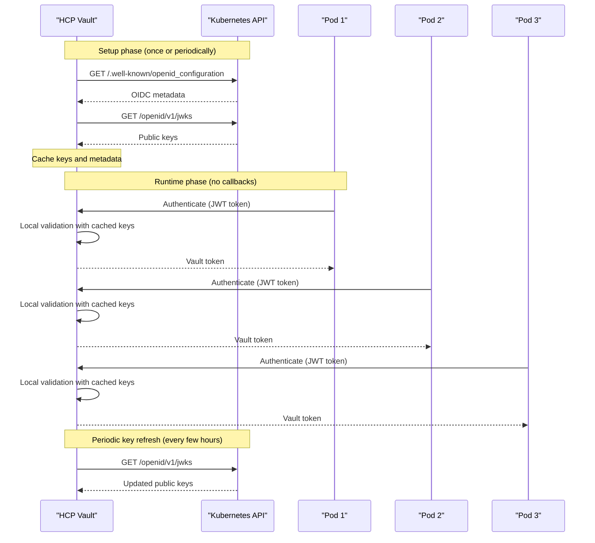

# JWT Authentication Callback Comparison: TokenReview vs OIDC/JWT

## Executive Summary

While both authentication methods involve some communication between HCP Vault and your AKS cluster, the **frequency and purpose** are dramatically different:

- **TokenReview**: Per-request callbacks for every authentication
- **OIDC/JWT**: Infrequent setup and key refresh calls only

## Detailed Callback Analysis

### TokenReview Method (Current Implementation)



**Callback Pattern:**
- **Frequency**: Every authentication request
- **Purpose**: Validate each individual JWT token
- **Network Impact**: High - scales with authentication volume
- **Latency**: Adds network round-trip to each auth

### OIDC/JWT Method (Recommended)



**Callback Pattern:**
- **Frequency**: Setup + periodic refresh (e.g., every 4-24 hours)
- **Purpose**: Fetch public keys for JWT signature validation
- **Network Impact**: Minimal - independent of authentication volume
- **Latency**: No impact on authentication performance

## Quantitative Comparison

### Scenario: 1000 Pod Authentications per Hour

| Method | Callbacks to K8s | Purpose | When |
|--------|------------------|---------|------|
| **TokenReview** | 1000 per hour | Validate each token | Every authentication |
| **OIDC/JWT** | 1-2 per hour | Refresh public keys | Periodic key rotation |

### Network Traffic Analysis

```bash
# TokenReview method
# Per authentication: ~2KB request + response
# 1000 auths/hour = ~2MB/hour + latency impact

# OIDC/JWT method  
# Key refresh: ~5KB every 4-24 hours
# 1000 auths/hour = ~5KB/day + no latency impact
```

## What HCP Vault Actually Fetches

### OIDC Discovery Endpoint
```json
# GET https://your-aks-cluster/.well-known/openid_configuration
{
  "issuer": "https://kubernetes.default.svc.cluster.local",
  "jwks_uri": "https://your-aks-cluster/openid/v1/jwks",
  "response_types_supported": ["id_token"],
  "subject_types_supported": ["public"],
  "id_token_signing_alg_values_supported": ["RS256"]
}
```

### JWKS (JSON Web Key Set) Endpoint
```json
# GET https://your-aks-cluster/openid/v1/jwks
{
  "keys": [
    {
      "use": "sig",
      "kty": "RSA",
      "kid": "key-id-1",
      "alg": "RS256",
      "n": "public-key-modulus...",
      "e": "AQAB"
    }
  ]
}
```

## Key Refresh Behavior

### When Does HCP Vault Refresh Keys?

1. **Initial Configuration**: When JWT auth method is configured
2. **Key Rotation**: When Kubernetes rotates signing keys
3. **Cache Expiration**: Based on TTL in JWKS response (typically 24 hours)
4. **Failed Validation**: If JWT validation fails due to unknown key ID

### Configuration Control

```bash
# You can control refresh behavior
vault write auth/kubernetes-jwt/config \
    oidc_discovery_url="https://your-aks-cluster" \
    oidc_discovery_ca_pem="$CA_CERT" \
    jwks_cache_ttl="24h"  # Control how often keys are refreshed
```

## Network Security Implications

### Firewall Rules Comparison

**TokenReview Method:**
```bash
# Required: Bidirectional HTTPS
# HCP Vault → AKS: Port 443 (per authentication)
# AKS ← HCP Vault: Port 443 (per authentication)
```

**OIDC/JWT Method:**
```bash
# Required: Unidirectional HTTPS  
# HCP Vault → AKS: Port 443 (periodic key refresh only)
# No inbound connections during authentication
```

### Private Endpoint Considerations

**TokenReview**: Requires bidirectional connectivity
**OIDC/JWT**: Only requires outbound connectivity from HCP to AKS

## Performance Impact Analysis

### Authentication Latency

| Method | Network Calls | Typical Latency |
|--------|---------------|-----------------|
| TokenReview | 1 per auth | +50-200ms |
| OIDC/JWT | 0 per auth | +0-5ms |

### Kubernetes API Load

| Method | API Calls | K8s Impact |
|--------|-----------|------------|
| TokenReview | High volume | Scales with auth requests |
| OIDC/JWT | Minimal | Independent of auth volume |

## Migration Considerations

### Gradual Migration Strategy

1. **Phase 1**: Enable JWT auth alongside TokenReview
2. **Phase 2**: Test with low-volume applications
3. **Phase 3**: Migrate high-volume applications
4. **Phase 4**: Disable TokenReview method

### Monitoring During Migration

```bash
# Monitor callback frequency
kubectl top pods -n kube-system | grep kube-apiserver

# Monitor HCP Vault performance
vault audit list
vault metrics
```

## Conclusion

**Yes, HCP Vault does make calls to your AKS cluster in OIDC/JWT mode, but:**

✅ **Frequency**: Periodic (hours) vs per-request (seconds)  
✅ **Purpose**: Key refresh vs token validation  
✅ **Performance**: No impact on auth latency  
✅ **Scalability**: Independent of authentication volume  
✅ **Security**: Unidirectional vs bidirectional connectivity  

The OIDC/JWT method represents a **99%+ reduction** in callbacks while maintaining the same security guarantees.

## Recommended Action

**Implement OIDC/JWT authentication** for your AKS-HCP Vault integration to achieve:
- Minimal network dependency
- Better authentication performance  
- Reduced load on Kubernetes API server
- Simplified network security policies
- Enhanced scalability for high-volume workloads