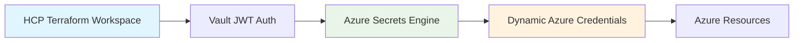
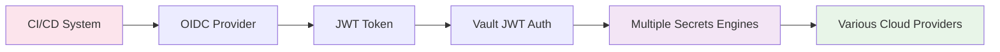

# JWT Integration Comparison: Our Implementation vs HashiCorp Validated Pattern

## Overview

This document compares our HCP Terraform Vault integration with the standard HashiCorp validated pattern for Terraform-Vault integration. While both use JWT authentication, they serve different purposes and have distinct architectures.

## Key Differences Summary

| Aspect | Our HCP Terraform Integration | HashiCorp Validated Pattern |
|--------|------------------------------|------------------------------|
| **Primary Purpose** | Dynamic Azure credentials in HCP Terraform | General Terraform-Vault integration |
| **Environment** | HCP Terraform Cloud (managed) | Self-managed Terraform / Local runs |
| **JWT Source** | HCP Terraform workload identity | CI/CD system (GitHub, GitLab, etc.) |
| **Authentication Flow** | HCP Terraform → Vault → Azure | CI/CD → Vault → Multiple providers |
| **Credential Target** | Azure service principals | Various cloud provider credentials |
| **Token Issuer** | `https://app.terraform.io` | Various (GitHub, GitLab, etc.) |
| **Workspace Identity** | Built-in HCP Terraform identity | External CI/CD job identity |

## Detailed Comparison

### 1. Architecture Differences

#### Our HCP Terraform Integration


**Key Characteristics:**
- **Managed Environment**: Runs entirely in HCP Terraform Cloud
- **Workspace-Centric**: Each workspace has its own identity
- **Azure-Specific**: Focused on Azure dynamic credentials
- **Automatic Token Provision**: HCP Terraform automatically provides JWT tokens

#### HashiCorp Validated Pattern


**Key Characteristics:**
- **CI/CD Driven**: Initiated from external CI/CD systems
- **Multi-Provider**: Supports multiple cloud providers
- **OIDC Integration**: Uses external OIDC providers
- **Manual Token Management**: Requires explicit token handling

### 2. JWT Token Differences

#### Our Implementation
```yaml
# JWT Token Claims
{
  "iss": "https://app.terraform.io",
  "sub": "organization:my-org:workspace:azure-infra:run_phase:plan",
  "aud": "vault.workload.identity",
  "terraform_organization": "my-org",
  "terraform_workspace": "azure-infra",
  "terraform_run_phase": "plan",
  "terraform_full_workspace": "my-org/azure-infra"
}
```

**Token Characteristics:**
- **Issuer**: Always `https://app.terraform.io`
- **Subject**: Contains organization, workspace, and run phase
- **Audience**: Fixed to `vault.workload.identity`
- **Custom Claims**: HCP Terraform-specific metadata

#### HashiCorp Validated Pattern
```yaml
# JWT Token Claims (GitHub Actions example)
{
  "iss": "https://token.actions.githubusercontent.com",
  "sub": "repo:my-org/my-repo:ref:refs/heads/main",
  "aud": "vault.example.com",
  "repository": "my-org/my-repo",
  "ref": "refs/heads/main",
  "sha": "abc123..."
}
```

**Token Characteristics:**
- **Issuer**: Various (GitHub, GitLab, Azure DevOps, etc.)
- **Subject**: Repository or job-specific identity
- **Audience**: Configurable based on use case
- **Custom Claims**: CI/CD system-specific metadata

### 3. Vault Configuration Differences

#### Our JWT Auth Backend Configuration
```hcl
# JWT auth backend specifically for HCP Terraform
resource "vault_jwt_auth_backend" "hcp_terraform" {
  description        = "JWT auth backend for HCP Terraform"
  path              = "hcp_terraform"
  oidc_discovery_url = "https://app.terraform.io"
  bound_issuer      = "https://app.terraform.io"
}

# Role binding to specific workspace
resource "vault_jwt_auth_backend_role" "hcp_terraform" {
  backend         = vault_jwt_auth_backend.hcp_terraform.path
  role_name       = "hcp-terraform-azure"
  token_policies  = ["hcp-terraform-azure"]
  
  bound_audiences = ["vault.workload.identity"]
  bound_claims = {
    sub = "organization:${var.hcp_terraform_organization}:workspace:${var.hcp_terraform_workspace_name}:run_phase:*"
  }
  
  user_claim = "terraform_full_workspace"
  role_type  = "jwt"
}
```

#### HashiCorp Validated Pattern Configuration
```hcl
# Generic JWT auth backend for CI/CD integration
resource "vault_jwt_auth_backend" "cicd" {
  description        = "JWT auth backend for CI/CD"
  path              = "jwt"
  oidc_discovery_url = "https://token.actions.githubusercontent.com"
  bound_issuer      = "https://token.actions.githubusercontent.com"
}

# Role binding to repository or job
resource "vault_jwt_auth_backend_role" "cicd" {
  backend         = vault_jwt_auth_backend.cicd.path
  role_name       = "cicd-role"
  token_policies  = ["cicd-policy"]
  
  bound_audiences = ["vault.example.com"]
  bound_claims = {
    repository = "my-org/my-repo"
    ref        = "refs/heads/main"
  }
  
  user_claim = "repository"
  role_type  = "jwt"
}
```

### 4. Use Case Differences

#### Our HCP Terraform Integration

**Primary Use Case**: Dynamic Azure credentials for HCP Terraform workspaces

**Typical Workflow**:
1. HCP Terraform workspace starts a run
2. Workspace authenticates to Vault using built-in JWT
3. Vault generates dynamic Azure service principal
4. Terraform uses credentials to deploy Azure resources
5. Credentials automatically expire after TTL

**Benefits**:
- **Zero Configuration**: No external OIDC setup required
- **Workspace Isolation**: Each workspace gets different permissions
- **Managed Security**: HCP Terraform handles token lifecycle
- **Azure Optimization**: Specifically designed for Azure workloads

**Example Terraform Code**:
```hcl
provider "vault" {
  address   = var.vault_addr
  namespace = var.vault_namespace
  
  auth_login_jwt {
    role  = "hcp-terraform-azure"
    mount = "hcp_terraform"
  }
}

data "vault_generic_secret" "azure_creds" {
  path = "azure/creds/hcp-terraform"
}

provider "azurerm" {
  subscription_id = var.azure_subscription_id
  tenant_id       = var.azure_tenant_id
  client_id       = data.vault_generic_secret.azure_creds.data["client_id"]
  client_secret   = data.vault_generic_secret.azure_creds.data["client_secret"]
}
```

#### HashiCorp Validated Pattern

**Primary Use Case**: General CI/CD integration with multiple cloud providers

**Typical Workflow**:
1. CI/CD job starts (GitHub Actions, GitLab CI, etc.)
2. Job obtains OIDC token from CI/CD platform
3. Terraform authenticates to Vault using token
4. Vault provides credentials for various cloud providers
5. Terraform deploys across multiple clouds

**Benefits**:
- **Multi-Cloud**: Supports AWS, Azure, GCP, etc.
- **CI/CD Agnostic**: Works with any OIDC-capable CI/CD system
- **Flexible**: Can be customized for various use cases
- **Self-Managed**: Full control over configuration

**Example Terraform Code**:
```hcl
provider "vault" {
  address = var.vault_addr
  
  auth_login_jwt {
    role  = "cicd-role"
    mount = "jwt"
  }
}

# Get AWS credentials
data "vault_aws_access_credentials" "aws" {
  backend = "aws"
  role    = "aws-role"
}

# Get Azure credentials  
data "vault_generic_secret" "azure" {
  path = "azure/creds/azure-role"
}

provider "aws" {
  access_key = data.vault_aws_access_credentials.aws.access_key
  secret_key = data.vault_aws_access_credentials.aws.secret_key
}

provider "azurerm" {
  client_id     = data.vault_generic_secret.azure.data["client_id"]
  client_secret = data.vault_generic_secret.azure.data["client_secret"]
}
```

### 5. Security Model Comparison

#### Our Implementation Security Features

1. **Workspace-Based Identity**:
   - Each HCP Terraform workspace has a unique identity
   - Bound claims include organization, workspace, and run phase
   - Automatic token rotation by HCP Terraform

2. **Azure-Specific Controls**:
   - Dedicated Azure roles with minimal permissions
   - Short-lived Azure service principals (15min-24h)
   - Automatic credential cleanup

3. **HCP Terraform Integration**:
   - Built-in audit logging in HCP Terraform
   - Native integration with HCP Terraform's security model
   - No external OIDC configuration required

#### HashiCorp Validated Pattern Security Features

1. **CI/CD-Based Identity**:
   - Repository or job-based identity
   - Bound claims include repository, branch, or job metadata
   - Token lifecycle managed by CI/CD platform

2. **Multi-Cloud Controls**:
   - Different policies for different cloud providers
   - Flexible credential types (static, dynamic, temporary)
   - Customizable TTLs per provider

3. **External OIDC Integration**:
   - Leverages external OIDC providers (GitHub, GitLab, etc.)
   - Requires proper OIDC configuration
   - More complex trust relationship setup

### 6. When to Use Each Approach

#### Use Our HCP Terraform Integration When:

- ✅ You're using HCP Terraform Cloud
- ✅ Primary focus is Azure infrastructure
- ✅ You want zero-configuration security
- ✅ You need workspace-level isolation
- ✅ You prefer managed solutions
- ✅ You want built-in credential lifecycle management

#### Use HashiCorp Validated Pattern When:

- ✅ You're using self-managed Terraform
- ✅ You need multi-cloud support
- ✅ You have existing CI/CD pipelines
- ✅ You want maximum flexibility
- ✅ You have complex authentication requirements
- ✅ You need integration with various OIDC providers

## Configuration Examples

### Our Implementation Setup
```bash
# One-command setup
./scripts/hcp-terraform-vault-setup.sh \
  --organization "my-org" \
  --workspace "azure-infrastructure"

# Workspace variables (automatically configured)
VAULT_ADDR = "https://vault.hashicorp.cloud:8200"
ARM_SUBSCRIPTION_ID = "subscription-id"
ARM_TENANT_ID = "tenant-id"
```

### HashiCorp Validated Pattern Setup
```bash
# Manual Vault configuration
vault auth enable -path=jwt jwt
vault write auth/jwt/config \
  oidc_discovery_url="https://token.actions.githubusercontent.com" \
  bound_issuer="https://token.actions.githubusercontent.com"

# GitHub Actions workflow configuration
- name: Import secrets
  id: secrets
  uses: hashicorp/vault-action@v2
  with:
    url: ${{ secrets.VAULT_URL }}
    method: jwt
    role: github-actions
    secrets: |
      aws/creds/deploy access_key | AWS_ACCESS_KEY_ID
      aws/creds/deploy secret_key | AWS_SECRET_ACCESS_KEY
```

## Conclusion

Both approaches use JWT authentication with Vault, but they serve different purposes:

- **Our HCP Terraform Integration** is optimized for HCP Terraform users who want seamless, zero-configuration Azure credential management with built-in security best practices.

- **HashiCorp Validated Pattern** is a general-purpose solution for integrating any CI/CD system with Vault for multi-cloud credential management with maximum flexibility.

The choice depends on your environment, requirements, and preferred level of management overhead. Our implementation provides a more streamlined experience for HCP Terraform and Azure users, while the validated pattern offers broader compatibility and customization options.