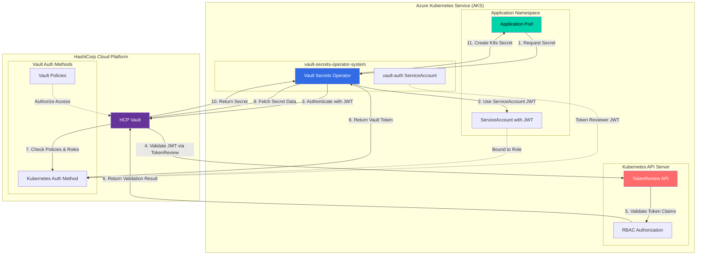
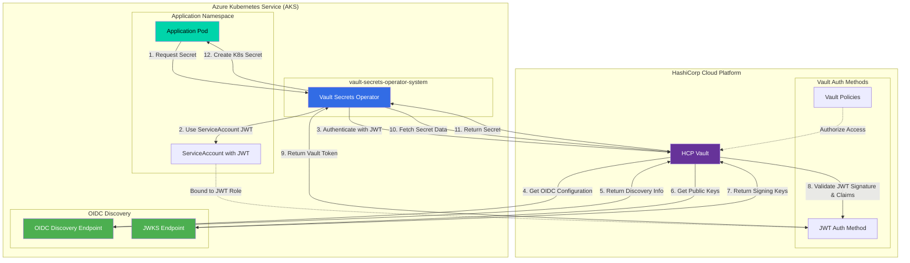
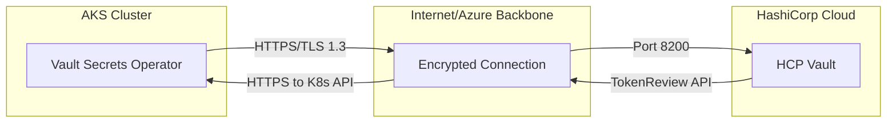

# AKS to HCP Vault JWT Authentication Flow

## High-Level Architecture Diagram

### Option 1: TokenReview Method (Current)



### Option 2: OIDC/JWT Method (Recommended)



## Comparison: TokenReview vs OIDC/JWT Authentication

### TokenReview Method (Current Implementation)

**Advantages:**
- Well-established pattern
- Supported by all Kubernetes versions
- Direct integration with Kubernetes RBAC

**Disadvantages:**
- Requires network callback to Kubernetes API
- Additional ServiceAccount (`vault-auth`) needed
- Higher latency due to external API calls
- Network dependency on Kubernetes API availability
- More complex network security policies

### OIDC/JWT Method (Recommended)

**Advantages:**
- ✅ **No network callbacks** - HCP Vault validates tokens locally
- ✅ **Better performance** - Faster authentication, lower latency
- ✅ **Simplified architecture** - No special ServiceAccounts needed
- ✅ **Enhanced security** - Standard OIDC practices
- ✅ **Reduced dependencies** - Works even if K8s API is temporarily unavailable
- ✅ **Cleaner network policies** - Only outbound HTTPS required

**Requirements:**
- Kubernetes 1.21+ (for built-in OIDC discovery)
- OIDC discovery endpoint must be accessible from HCP Vault
- Proper JWT audience configuration

### Migration Benefits

Switching to OIDC/JWT authentication provides:

1. **Elimination of TokenReview API calls** - No more callbacks to Kubernetes
2. **Simplified network architecture** - Only outbound connections needed
3. **Improved performance** - JWT validation is local to HCP Vault
4. **Better scalability** - Reduces load on Kubernetes API server
5. **Enhanced security posture** - Standard OIDC validation practices

## JWT Authentication Flow Details

### Step-by-Step Process

1. **Application Request**: Application pod requests a secret through VSO (via CRDs like VaultStaticSecret)

2. **ServiceAccount JWT**: VSO uses the pod's ServiceAccount JWT token for authentication

3. **Vault Authentication**: VSO sends authentication request to HCP Vault's Kubernetes auth endpoint

4. **Token Validation**: HCP Vault forwards the JWT to Kubernetes TokenReview API for validation

5. **Claims Verification**: Kubernetes API server validates the JWT signature and returns token claims

6. **Policy Check**: HCP Vault checks if the ServiceAccount is authorized based on configured roles

7. **Vault Token**: Upon successful authentication, HCP Vault returns a time-limited Vault token

8. **Secret Retrieval**: VSO uses the Vault token to fetch the requested secret data

9. **Kubernetes Secret**: VSO creates a native Kubernetes Secret with the retrieved data

10. **Application Access**: Application pod consumes the secret via mounted volumes or environment variables

## Key Security Components

### Kubernetes Side
- **ServiceAccount JWT**: Cryptographically signed tokens with claims (namespace, service account, expiration)
- **TokenReview API**: Kubernetes endpoint for validating JWT tokens
- **RBAC**: Controls which service accounts can perform token reviews
- **vault-auth ServiceAccount**: Special account with `system:auth-delegator` role for token validation

### HCP Vault Side
- **Kubernetes Auth Method**: Validates JWTs against Kubernetes API
- **Roles**: Bind specific ServiceAccounts/namespaces to Vault policies
- **Policies**: Define what secrets and operations are allowed
- **TLS Verification**: All communication encrypted and certificate-verified

## Network Connectivity Requirements



### Connectivity Details
- **Outbound from AKS**: HTTPS/TLS to HCP Vault (typically port 8200)
- **Inbound to AKS**: HCP Vault calls Kubernetes TokenReview API (port 6443/443)
- **Network Security**: All traffic encrypted, certificate validation required
- **No Static Credentials**: Only cryptographically signed JWTs used for authentication

## Configuration Summary

### AKS Configuration
```yaml
# ServiceAccount for applications
apiVersion: v1
kind: ServiceAccount
metadata:
  name: webapp
  namespace: production

# ServiceAccount for token validation
apiVersion: v1
kind: ServiceAccount
metadata:
  name: vault-auth
  namespace: vault-secrets-operator-system
```

### HCP Vault Configuration
```bash
# Kubernetes auth method configuration
vault write auth/kubernetes/config \
    token_reviewer_jwt="$reviewer_jwt" \
    kubernetes_host="https://your-aks-cluster.hcp.azure.com" \
    kubernetes_ca_cert="$k8s_ca_cert" \
    issuer="https://kubernetes.default.svc.cluster.local"

# Role binding ServiceAccount to policies
vault write auth/kubernetes/role/webapp \
    bound_service_account_names=webapp \
    bound_service_account_namespaces=production \
    policies=webapp-policy \
    ttl=1h
```

This architecture ensures secure, auditable, and dynamic secret access without storing long-lived credentials in your AKS cluster.