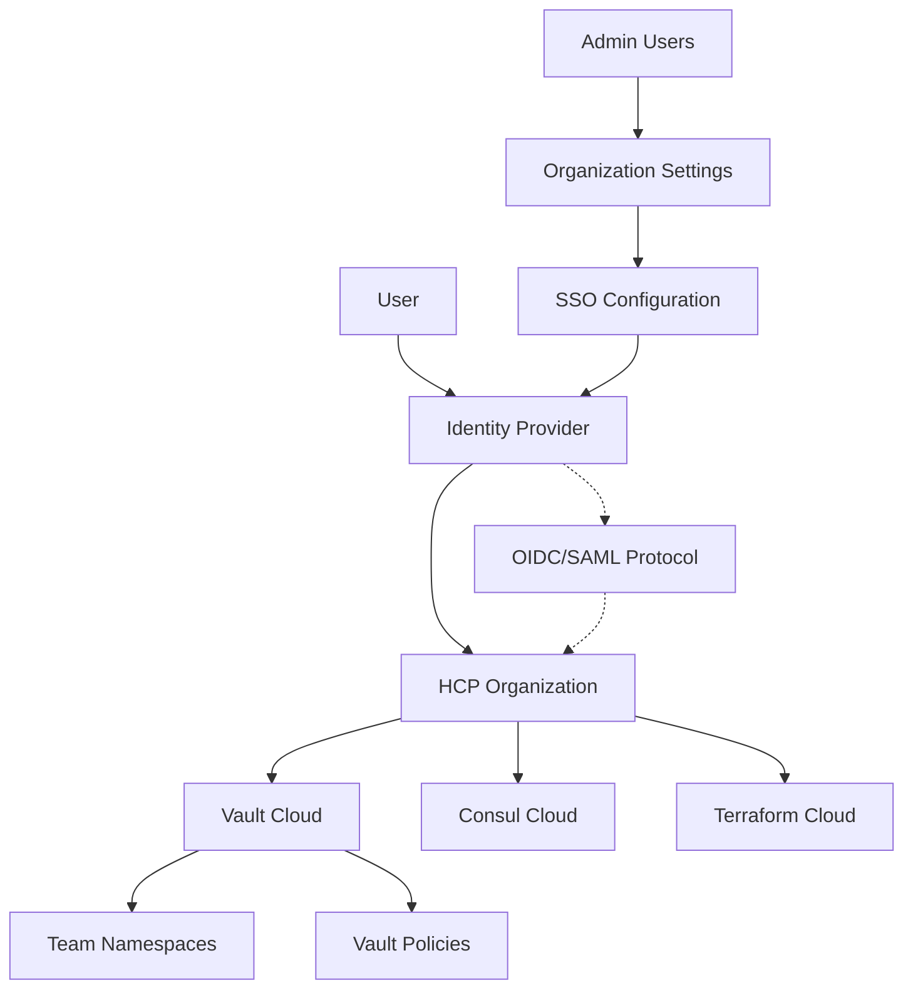

# HCP Organization SSO Setup Guide

This guide provides comprehensive instructions for setting up Single Sign-On (SSO) authentication at the HashiCorp Cloud Platform (HCP) Organization level, enabling centralized identity management for all HCP services including Vault Cloud.

## Table of Contents

1. [Overview](#overview)
2. [Prerequisites](#prerequisites)
3. [Supported Identity Providers](#supported-identity-providers)
4. [OIDC Configuration](#oidc-configuration)
5. [SAML Configuration](#saml-configuration)
6. [User and Group Management](#user-and-group-management)
7. [Role-Based Access Control](#role-based-access-control)
8. [Testing and Validation](#testing-and-validation)
9. [Troubleshooting](#troubleshooting)
10. [Best Practices](#best-practices)

## Overview

HCP Organization SSO allows you to integrate your existing identity provider with HashiCorp Cloud Platform, providing:

- **Centralized Authentication**: Single point of authentication for all HCP services
- **Enhanced Security**: Leverage your existing identity provider's security features
- **User Management**: Synchronize users and groups from your identity provider
- **Role-Based Access**: Map identity provider groups to HCP roles and permissions
- **Audit Trail**: Comprehensive audit logging for authentication events

### SSO Architecture



## Prerequisites

### Required Access and Permissions

- **HCP Organization Owner** or **Organization Admin** role
- **Identity Provider Admin** access (Azure AD, Okta, Auth0, etc.)
- **Domain Ownership Verification** for the organization
- **DNS Management** access for domain verification

### Technical Requirements

- **TLS/SSL Certificate** for the identity provider
- **Network Access** from identity provider to HCP
- **Domain Verification** for the organization
- **Test Users** for validation

### Identity Provider Requirements

- Support for **OIDC** or **SAML 2.0** protocols
- Ability to configure **custom claims** and **group mappings**
- Support for **Just-In-Time (JIT) user provisioning**
- **Multi-Factor Authentication** capabilities

## Supported Identity Providers

HCP supports integration with various identity providers:

### OIDC Providers
- **Azure Active Directory (Azure AD)**
- **Google Workspace**
- **Okta**
- **Auth0**
- **PingIdentity**
- **Keycloak**
- **Generic OIDC providers**

### SAML Providers
- **Azure Active Directory (SAML)**
- **Okta (SAML)**
- **PingIdentity**
- **OneLogin**
- **ADFS**
- **Generic SAML 2.0 providers**

## OIDC Configuration

### Step 1: Configure Identity Provider

#### Azure Active Directory (OIDC)

1. **Register Application in Azure AD**:
```bash
# Create Azure AD application
az ad app create \
    --display-name "HCP Organization SSO" \
    --web-redirect-uris "https://auth.hashicorp.com/login/callback" \
    --sign-in-audience "AzureADMyOrg"
```

2. **Configure Application Settings**:
```json
{
    "name": "HCP Organization SSO",
    "signInAudience": "AzureADMyOrg",
    "web": {
        "redirectUris": [
            "https://auth.hashicorp.com/login/callback"
        ],
        "implicitGrantSettings": {
            "enableIdTokenIssuance": true
        }
    },
    "requiredResourceAccess": [
        {
            "resourceAppId": "00000003-0000-0000-c000-000000000000",
            "resourceAccess": [
                {
                    "id": "e1fe6dd8-ba31-4d61-89e7-88639da4683d",
                    "type": "Scope"
                }
            ]
        }
    ]
}
```

3. **Generate Client Secret**:
```bash
# Create client secret
az ad app credential reset \
    --id <application-id> \
    --display-name "HCP SSO Secret" \
    --years 2
```

4. **Configure Optional Claims**:
```json
{
    "idToken": [
        {
            "name": "groups",
            "source": "user",
            "essential": false,
            "additionalProperties": ["emit_as_roles"]
        },
        {
            "name": "email",
            "source": "user",
            "essential": true
        },
        {
            "name": "given_name",
            "source": "user",
            "essential": false
        },
        {
            "name": "family_name",
            "source": "user",
            "essential": false
        }
    ]
}
```

#### Generic OIDC Provider Configuration

For other OIDC providers, ensure the following configuration:

```yaml
# OIDC Provider Settings
issuer_url: "https://your-provider.com"
client_id: "hcp-organization-client"
client_secret: "secure-client-secret"
scopes: ["openid", "profile", "email", "groups"]
redirect_uri: "https://auth.hashicorp.com/login/callback"

# Required Claims
claims:
  user_id: "sub"
  email: "email"
  name: "name"
  groups: "groups"  # or "roles"
```

### Step 2: Configure HCP Organization SSO

1. **Access Organization Settings**:
   - Log in to [HCP Console](https://portal.cloud.hashicorp.com)
   - Navigate to **Organization Settings** → **Authentication**

2. **Enable SSO**:
```bash
# Using HCP CLI (if available)
hcp organizations authentication enable-sso \
    --provider-type=oidc \
    --provider-name="Azure AD" \
    --issuer-url="https://login.microsoftonline.com/{tenant-id}/v2.0" \
    --client-id="{client-id}" \
    --client-secret="{client-secret}"
```

3. **Configure OIDC Settings**:
```json
{
    "providerType": "oidc",
    "providerName": "Azure AD",
    "issuerUrl": "https://login.microsoftonline.com/{tenant-id}/v2.0",
    "clientId": "{client-id}",
    "clientSecret": "{client-secret}",
    "scopes": ["openid", "profile", "email", "groups"],
    "claimMappings": {
        "userId": "sub",
        "email": "email",
        "name": "name",
        "groups": "groups"
    },
    "jitProvisioning": true,
    "enforceSSO": false
}
```

## SAML Configuration

### Step 1: Configure SAML Identity Provider

#### Azure Active Directory (SAML)

1. **Create Enterprise Application**:
```powershell
# PowerShell script for Azure AD SAML setup
$app = New-AzADServicePrincipal -DisplayName "HCP Organization SAML"

# Configure SAML settings
$samlConfig = @{
    EntityId = "https://auth.hashicorp.com/saml/metadata"
    ReplyUrl = "https://auth.hashicorp.com/saml/acs"
    SignOnUrl = "https://portal.cloud.hashicorp.com"
    LogoutUrl = "https://auth.hashicorp.com/saml/sls"
}
```

2. **Configure SAML Claims**:
```xml
<!-- SAML Claim Configuration -->
<saml:AttributeStatement>
    <saml:Attribute Name="http://schemas.xmlsoap.org/ws/2005/05/identity/claims/emailaddress">
        <saml:AttributeValue>user.mail</saml:AttributeValue>
    </saml:Attribute>
    <saml:Attribute Name="http://schemas.xmlsoap.org/ws/2005/05/identity/claims/name">
        <saml:AttributeValue>user.displayname</saml:AttributeValue>
    </saml:Attribute>
    <saml:Attribute Name="http://schemas.xmlsoap.org/ws/2005/05/identity/claims/groups">
        <saml:AttributeValue>user.groups</saml:AttributeValue>
    </saml:Attribute>
</saml:AttributeStatement>
```

### Step 2: Configure HCP SAML Settings

```json
{
    "providerType": "saml",
    "providerName": "Azure AD SAML",
    "ssoUrl": "https://login.microsoftonline.com/{tenant-id}/saml2",
    "entityId": "https://sts.windows.net/{tenant-id}/",
    "x509Certificate": "-----BEGIN CERTIFICATE-----\n...\n-----END CERTIFICATE-----",
    "attributeMappings": {
        "userId": "http://schemas.xmlsoap.org/ws/2005/05/identity/claims/nameidentifier",
        "email": "http://schemas.xmlsoap.org/ws/2005/05/identity/claims/emailaddress",
        "name": "http://schemas.xmlsoap.org/ws/2005/05/identity/claims/name",
        "groups": "http://schemas.xmlsoap.org/ws/2005/05/identity/claims/groups"
    },
    "jitProvisioning": true,
    "enforceSSO": false
}
```

## User and Group Management

### Group Synchronization

Configure group synchronization to automatically map identity provider groups to HCP roles:

```yaml
# Group Mapping Configuration
groupMappings:
  - identityProviderGroup: "HCP-Vault-Admins"
    hcpRole: "Admin"
    projects: ["vault-production", "vault-staging"]
  
  - identityProviderGroup: "HCP-Vault-Operators"
    hcpRole: "Contributor"
    projects: ["vault-production"]
  
  - identityProviderGroup: "HCP-Vault-Developers"
    hcpRole: "Viewer"
    projects: ["vault-staging", "vault-development"]
  
  - identityProviderGroup: "HCP-Platform-Engineers"
    hcpRole: "Admin"
    projects: ["*"]  # All projects
```

### Just-In-Time (JIT) Provisioning

Enable JIT provisioning to automatically create user accounts:

```json
{
    "jitProvisioning": {
        "enabled": true,
        "defaultRole": "Viewer",
        "defaultProjects": ["vault-development"],
        "attributeMapping": {
            "firstName": "given_name",
            "lastName": "family_name",
            "email": "email",
            "groups": "groups"
        }
    }
}
```

## Role-Based Access Control

### HCP Organization Roles

Define role-based access control for HCP organization:

```yaml
# HCP Organization RBAC Configuration
roles:
  owner:
    description: "Full organization access"
    permissions:
      - "organization:*"
      - "projects:*"
      - "billing:*"
      - "users:*"
    
  admin:
    description: "Administrative access to projects"
    permissions:
      - "projects:read"
      - "projects:write"
      - "projects:delete"
      - "users:read"
      - "users:invite"
    
  contributor:
    description: "Project access and resource management"
    permissions:
      - "projects:read"
      - "projects:write"
      - "resources:*"
    
  viewer:
    description: "Read-only access"
    permissions:
      - "projects:read"
      - "resources:read"
```

### Project-Level Access

Configure project-specific access control:

```yaml
# Project Access Configuration
projects:
  vault-production:
    roles:
      - role: "admin"
        groups: ["HCP-Vault-Admins", "Platform-Engineers"]
      - role: "contributor"
        groups: ["HCP-Vault-Operators"]
      - role: "viewer"
        groups: ["Security-Team"]
  
  vault-staging:
    roles:
      - role: "admin"
        groups: ["HCP-Vault-Admins", "Platform-Engineers"]
      - role: "contributor"
        groups: ["HCP-Vault-Operators", "HCP-Vault-Developers"]
  
  vault-development:
    roles:
      - role: "contributor"
        groups: ["HCP-Vault-Developers", "QA-Engineers"]
```

## Testing and Validation

### SSO Configuration Testing

1. **Test OIDC Configuration**:
```bash
#!/bin/bash
# Test OIDC endpoint connectivity
curl -s "https://login.microsoftonline.com/{tenant-id}/v2.0/.well-known/openid_configuration" | jq .

# Validate OIDC token
curl -X POST "https://login.microsoftonline.com/{tenant-id}/oauth2/v2.0/token" \
    -H "Content-Type: application/x-www-form-urlencoded" \
    -d "client_id={client-id}" \
    -d "client_secret={client-secret}" \
    -d "grant_type=client_credentials" \
    -d "scope=https://graph.microsoft.com/.default"
```

2. **Test SAML Configuration**:
```bash
#!/bin/bash
# Validate SAML metadata
curl -s "https://login.microsoftonline.com/{tenant-id}/federationmetadata/2007-06/federationmetadata.xml" | xmllint --format -

# Test SAML SSO URL
curl -I "https://login.microsoftonline.com/{tenant-id}/saml2"
```

### User Login Testing

1. **Test User Authentication**:
```bash
# Test script for user authentication
#!/bin/bash
echo "Testing HCP SSO Authentication..."

# Test login with SSO user
echo "1. Navigate to: https://portal.cloud.hashicorp.com"
echo "2. Click 'Sign in with SSO'"
echo "3. Enter organization domain: {your-organization}.hashicorp.cloud"
echo "4. Authenticate with your identity provider"
echo "5. Verify access to HCP resources"
```

2. **Validate Group Mappings**:
```bash
# Verify group mappings
echo "Testing Group Mappings..."
echo "1. Log in as user from 'HCP-Vault-Admins' group"
echo "2. Verify admin access to Vault projects"
echo "3. Log in as user from 'HCP-Vault-Developers' group"
echo "4. Verify limited access to development projects"
```

## Troubleshooting

### Common Issues and Solutions

#### 1. OIDC Discovery Endpoint Issues
```bash
# Problem: OIDC discovery endpoint not accessible
# Solution: Verify network connectivity and DNS resolution
nslookup login.microsoftonline.com
curl -I "https://login.microsoftonline.com/{tenant-id}/v2.0/.well-known/openid_configuration"
```

#### 2. Invalid Client Credentials
```bash
# Problem: Authentication fails with invalid client credentials
# Solution: Verify client ID and secret configuration
# Check Azure AD application registration
az ad app show --id {client-id} --query "appId,displayName"
```

#### 3. Group Claims Not Received
```yaml
# Problem: User groups not properly mapped
# Solution: Configure optional claims in Azure AD
optionalClaims:
  idToken:
    - name: "groups"
      source: "user"
      essential: false
      additionalProperties: ["emit_as_roles"]
```

#### 4. SSO Login Redirect Loop
```bash
# Problem: Infinite redirect during SSO login
# Solution: Verify redirect URI configuration
# Ensure redirect URI matches exactly: https://auth.hashicorp.com/login/callback
```

### Diagnostic Commands

```bash
#!/bin/bash
# SSO Diagnostic Script

echo "=== HCP SSO Diagnostics ==="

# Check DNS resolution
echo "1. Testing DNS resolution..."
nslookup auth.hashicorp.com
nslookup portal.cloud.hashicorp.com

# Test HTTPS connectivity
echo "2. Testing HTTPS connectivity..."
curl -I https://auth.hashicorp.com
curl -I https://portal.cloud.hashicorp.com

# Validate OIDC endpoints
echo "3. Testing OIDC endpoints..."
curl -s "https://login.microsoftonline.com/{tenant-id}/v2.0/.well-known/openid_configuration" | jq '.issuer'

# Check certificate validity
echo "4. Checking SSL certificates..."
openssl s_client -connect auth.hashicorp.com:443 -servername auth.hashicorp.com < /dev/null 2>/dev/null | openssl x509 -noout -dates
```

## Best Practices

### Security Best Practices

1. **Use Strong Authentication**:
   - Enable multi-factor authentication (MFA) in your identity provider
   - Configure conditional access policies
   - Implement device compliance requirements

2. **Principle of Least Privilege**:
   - Grant minimum required permissions
   - Use time-limited access where possible
   - Regularly review and audit access

3. **Certificate Management**:
   - Use strong encryption (RSA 2048-bit minimum)
   - Implement certificate rotation procedures
   - Monitor certificate expiration

### Operational Best Practices

1. **Monitoring and Alerting**:
```yaml
# Example monitoring configuration
monitoring:
  alerts:
    - name: "SSO Authentication Failures"
      condition: "auth_failures > 10 in 5m"
      action: "notify_security_team"
    
    - name: "Certificate Expiration"
      condition: "cert_expires_in < 30d"
      action: "notify_platform_team"
```

2. **Backup and Recovery**:
   - Maintain emergency access procedures
   - Document SSO configuration settings
   - Test recovery procedures regularly

3. **Documentation and Training**:
   - Maintain up-to-date documentation
   - Train administrators on SSO management
   - Document troubleshooting procedures

### Integration Best Practices

1. **Gradual Rollout**:
   - Start with pilot group of users
   - Gradually expand to all users
   - Maintain traditional authentication as backup

2. **Testing Strategy**:
   - Test in non-production environment first
   - Validate all user scenarios
   - Test failure and recovery scenarios

3. **Change Management**:
   - Follow standard change management procedures
   - Communicate changes to users
   - Provide user training and support

## Next Steps

After configuring HCP Organization SSO:

1. **Configure Vault-Specific Authentication**:
   - Set up Vault OIDC auth method to integrate with HCP SSO
   - Configure Vault policies based on SSO groups
   - Implement namespace-based access control

2. **Enable Audit Logging**:
   - Configure comprehensive audit logging
   - Set up log aggregation and monitoring
   - Implement alerting for security events

3. **Implement Governance**:
   - Establish access review procedures
   - Configure automated compliance reporting
   - Implement policy enforcement

4. **Train Users and Administrators**:
   - Provide SSO user training
   - Train administrators on SSO management
   - Document operational procedures

For Vault-specific SSO integration, see the [Vault OIDC Authentication Guide](../user-guides/09-vault-oidc-authentication.md) and [Multi-Team Onboarding Guide](../user-guides/08-multi-team-onboarding.md).