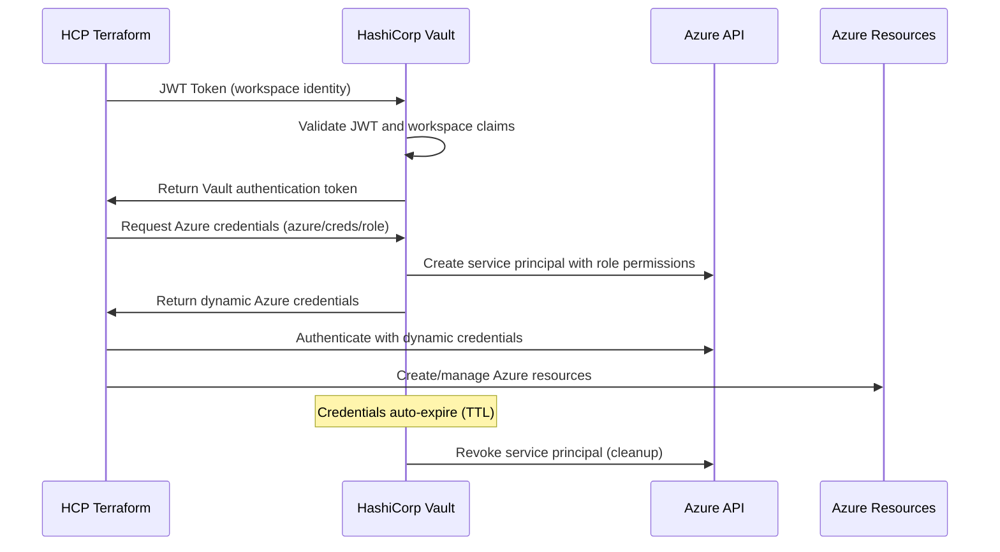
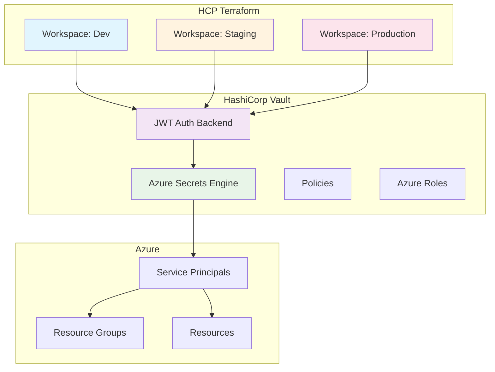

# HCP Terraform Integration with Vault Dynamic Azure Credentials - Setup Guide

This comprehensive guide walks you through setting up HCP Terraform to use HashiCorp Vault for dynamic Azure credentials, eliminating the need for static service principal secrets in your Terraform Cloud workspaces.

## Table of Contents

1. [Overview](#overview)
2. [Prerequisites](#prerequisites)
3. [Architecture](#architecture)
4. [Quick Start](#quick-start)
5. [Detailed Setup](#detailed-setup)
6. [Configuration Examples](#configuration-examples)
7. [Security Considerations](#security-considerations)
8. [Monitoring and Troubleshooting](#monitoring-and-troubleshooting)
9. [Best Practices](#best-practices)
10. [Advanced Configuration](#advanced-configuration)

## Overview

### What This Integration Provides

- **Dynamic Azure Credentials**: Short-lived Azure service principal credentials generated on-demand
- **No Static Secrets**: Eliminates long-lived secrets stored in HCP Terraform workspaces
- **Automatic Rotation**: Credentials are automatically rotated and cleaned up
- **Complete Audit Trail**: All credential access is logged in Vault
- **Workspace Isolation**: Each workspace can use different Azure roles and permissions
- **Least Privilege Access**: Fine-grained permissions based on workspace needs

### How It Works



### Benefits

- **Enhanced Security**: No static credentials in version control or workspace variables
- **Simplified Management**: Centralized credential management in Vault
- **Improved Compliance**: Complete audit trail and automatic credential lifecycle
- **Reduced Risk**: Short-lived credentials minimize exposure window
- **Better Governance**: Role-based access control per workspace

## Prerequisites

### Required Tools and Access

1. **HashiCorp Vault Cluster**:
   - HCP Vault or self-hosted Vault (v1.12+)
   - Admin access to configure authentication and secrets engines
   - Azure secrets engine enabled and configured

2. **HCP Terraform**:
   - HCP Terraform organization with workspace creation permissions
   - API token with appropriate permissions

3. **Azure Access**:
   - Azure subscription with Contributor or Owner permissions
   - Azure CLI installed and authenticated (`az login`)
   - Service principal for Vault Azure integration

4. **Local Development Tools**:
   - Vault CLI (v1.12+)
   - Terraform CLI (v1.0+)
   - Git (for version control)
   - jq (for JSON processing)

### Environment Variables

Before starting, set these environment variables:

```bash
# Vault Configuration
export VAULT_ADDR="https://your-vault-cluster.vault.hashicorp.cloud:8200"
export VAULT_TOKEN="your-vault-admin-token"
export VAULT_NAMESPACE="admin"  # For HCP Vault

# Azure Configuration
export AZURE_SUBSCRIPTION_ID="12345678-1234-1234-1234-123456789012"
export AZURE_TENANT_ID="87654321-4321-4321-4321-210987654321"

# HCP Terraform Configuration
export HCP_TERRAFORM_TOKEN="your-hcp-terraform-token"
```

## Architecture

### High-Level Architecture



### Security Model

1. **Authentication**: HCP Terraform workspaces authenticate to Vault using JWT tokens
2. **Authorization**: Vault policies control access to Azure credentials
3. **Credential Generation**: Vault creates short-lived Azure service principals
4. **Resource Access**: Azure resources are accessed using dynamic credentials
5. **Cleanup**: Credentials are automatically revoked when TTL expires

## Quick Start

### Step 1: Prerequisites Check

```bash
# Verify Vault connection
vault status

# Verify Azure login
az account show

# Verify HCP Terraform access
curl -H "Authorization: Bearer $HCP_TERRAFORM_TOKEN" \
     https://app.terraform.io/api/v2/account/details
```

### Step 2: Run Setup Script

```bash
# Navigate to scripts directory
cd scripts/

# Run the automated setup script
./hcp-terraform-vault-setup.sh \
  --organization "your-hcp-org" \
  --workspace "azure-infrastructure" \
  --role "hcp-terraform"

# For production with custom settings
./hcp-terraform-vault-setup.sh \
  --organization "your-hcp-org" \
  --workspace "production-azure" \
  --role "terraform-prod" \
  --ttl "30m" \
  --max-ttl "2h"
```

### Step 3: Configure HCP Terraform Workspace

1. Create workspace in HCP Terraform UI
2. Set environment variables:
   ```
   VAULT_ADDR = "https://your-vault-cluster.vault.hashicorp.cloud:8200"
   VAULT_NAMESPACE = "admin"
   ARM_SUBSCRIPTION_ID = "your-subscription-id"
   ARM_TENANT_ID = "your-tenant-id"
   ```

3. Set Terraform variables:
   ```hcl
   environment = "dev"
   project_name = "myproject"
   azure_region = "East US"
   ```

### Step 4: Deploy Example Configuration

1. Copy the basic deployment example to your workspace
2. Run `terraform plan` to verify configuration
3. Run `terraform apply` to deploy resources

## Detailed Setup

### Step 1: Configure Vault Azure Secrets Engine

If not already configured, set up the Azure secrets engine:

```bash
# Enable Azure secrets engine
vault secrets enable azure

# Configure Azure connection
vault write azure/config \
    subscription_id="$AZURE_SUBSCRIPTION_ID" \
    tenant_id="$AZURE_TENANT_ID" \
    client_id="vault-service-principal-id" \
    client_secret="vault-service-principal-secret" \
    environment="AzurePublicCloud"

# Verify configuration
vault read azure/config
```

### Step 2: Create Azure Role for HCP Terraform

```bash
# Create Azure role with appropriate permissions
vault write azure/roles/hcp-terraform \
    azure_roles='[{
        "role_name": "Contributor",
        "scope": "/subscriptions/'$AZURE_SUBSCRIPTION_ID'"
    }]' \
    ttl="1h" \
    max_ttl="4h"

# Test credential generation
vault read azure/creds/hcp-terraform
```

### Step 3: Configure JWT Authentication

```bash
# Enable JWT auth backend
vault auth enable -path=hcp_terraform jwt

# Configure JWT authentication
vault write auth/hcp_terraform/config \
    oidc_discovery_url="https://app.terraform.io" \
    bound_issuer="https://app.terraform.io"
```

### Step 4: Create Vault Policy

```bash
# Create policy for HCP Terraform access
cat > hcp-terraform-azure-policy.hcl << 'EOF'
# Allow reading Azure dynamic credentials
path "azure/creds/hcp-terraform" {
  capabilities = ["read"]
}

# Allow reading role configuration
path "azure/roles/hcp-terraform" {
  capabilities = ["read"]
}

# Allow token renewal
path "auth/token/renew-self" {
  capabilities = ["update"]
}
EOF

vault policy write hcp-terraform-azure hcp-terraform-azure-policy.hcl
```

### Step 5: Create JWT Role

```bash
# Create JWT role for workspace authentication
vault write auth/hcp_terraform/role/hcp-terraform-azure \
    bound_audiences="vault.workload.identity" \
    bound_claims='sub=organization:your-org:workspace:azure-infrastructure:run_phase:*' \
    user_claim="terraform_full_workspace" \
    role_type="jwt" \
    token_policies="hcp-terraform-azure" \
    token_ttl=3600 \
    token_max_ttl=7200
```

### Step 6: Configure HCP Terraform Workspace

#### Environment Variables

| Variable | Value | Description |
|----------|-------|-------------|
| `VAULT_ADDR` | `https://your-vault.vault.hashicorp.cloud:8200` | Vault server URL |
| `VAULT_NAMESPACE` | `admin` | Vault namespace |
| `ARM_SUBSCRIPTION_ID` | `your-subscription-id` | Azure subscription |
| `ARM_TENANT_ID` | `your-tenant-id` | Azure tenant |

#### Terraform Variables

| Variable | Value | Description |
|----------|-------|-------------|
| `environment` | `dev` | Environment name |
| `project_name` | `myproject` | Project identifier |
| `azure_region` | `East US` | Azure region |

## Configuration Examples

### Basic Terraform Configuration

```hcl
# Configure providers
terraform {
  required_providers {
    vault = {
      source  = "hashicorp/vault"
      version = "~> 3.0"
    }
    azurerm = {
      source  = "hashicorp/azurerm"
      version = "~> 3.0"
    }
  }
}

# Vault provider with JWT authentication
provider "vault" {
  address   = var.vault_addr
  namespace = var.vault_namespace
  
  auth_login_jwt {
    role  = "hcp-terraform-azure"
    mount = "hcp_terraform"
  }
}

# Get dynamic Azure credentials
data "vault_generic_secret" "azure_creds" {
  path = "azure/creds/hcp-terraform"
}

# Azure provider with dynamic credentials
provider "azurerm" {
  features {}
  
  subscription_id = var.azure_subscription_id
  tenant_id       = var.azure_tenant_id
  client_id       = data.vault_generic_secret.azure_creds.data["client_id"]
  client_secret   = data.vault_generic_secret.azure_creds.data["client_secret"]
}
```

### Environment-Specific Configurations

#### Development Environment

```hcl
# Development-specific Azure role
vault write azure/roles/hcp-terraform-dev \
    azure_roles='[{
        "role_name": "Contributor",
        "scope": "/subscriptions/'$AZURE_SUBSCRIPTION_ID'/resourceGroups/dev-*"
    }]' \
    ttl="2h" \
    max_ttl="8h"
```

#### Production Environment

```hcl
# Production-specific Azure role with limited permissions
vault write azure/roles/hcp-terraform-prod \
    azure_roles='[{
        "role_name": "Reader",
        "scope": "/subscriptions/'$AZURE_SUBSCRIPTION_ID'"
    }, {
        "role_name": "Storage Account Contributor",
        "scope": "/subscriptions/'$AZURE_SUBSCRIPTION_ID'/resourceGroups/prod-storage"
    }]' \
    ttl="30m" \
    max_ttl="2h"
```

## Security Considerations

### Authentication Security

1. **JWT Token Validation**:
   - Vault validates workspace identity claims
   - Tokens are bound to specific organizations and workspaces
   - Short-lived authentication tokens (1-2 hours)

2. **Credential Lifecycle**:
   - Azure credentials have configurable TTL (15 minutes to 24 hours)
   - Automatic credential revocation on expiry
   - No credential reuse between runs

### Access Control

1. **Workspace Isolation**:
   ```bash
   # Each workspace has its own JWT role with specific claims
   vault write auth/hcp_terraform/role/workspace-dev \
       bound_claims='sub=organization:myorg:workspace:dev-*:run_phase:*'
   
   vault write auth/hcp_terraform/role/workspace-prod \
       bound_claims='sub=organization:myorg:workspace:prod-*:run_phase:*'
   ```

2. **Environment-Based Permissions**:
   ```bash
   # Development: Full access to dev resource groups
   # Staging: Limited access to staging resources
   # Production: Read-only with specific write permissions
   ```

### Network Security

1. **Private Endpoints**: Use Azure Private Link for Vault connectivity
2. **IP Restrictions**: Configure IP allowlists in HCP Terraform
3. **VNet Integration**: Peer HCP Vault HVN with Azure VNets

### Monitoring and Auditing

1. **Vault Audit Logs**: Enable audit logging for all authentication and secret access
2. **HCP Terraform Logs**: Monitor workspace run logs for credential usage
3. **Azure Activity Logs**: Track resource changes and access patterns

## Monitoring and Troubleshooting

### Monitoring Scripts

Use the provided monitoring script:

```bash
# Monitor Vault integration
./scripts/monitor-hcp-terraform-vault.sh

# Check specific workspace authentication
vault read auth/hcp_terraform/role/hcp-terraform-azure
```

### Common Issues and Solutions

#### 1. JWT Authentication Failed

**Error**: `failed to login to Vault: unable to complete JWT authentication`

**Solutions**:
- Verify `VAULT_ADDR` and `VAULT_NAMESPACE` are correct
- Check JWT role bound claims match workspace identity
- Ensure JWT auth backend is configured correctly

#### 2. Azure Provider Authentication Failed

**Error**: `building AzureRM Client: obtain subscription() from Azure CLI`

**Solutions**:
- Verify Azure secrets engine configuration
- Test credential generation manually: `vault read azure/creds/hcp-terraform`
- Check Azure subscription and tenant IDs

#### 3. Permission Denied

**Error**: `authorization failed: this request requires "Microsoft.Resources/resourceGroups/write"`

**Solutions**:
- Review Azure role permissions in Vault
- Check subscription-level access
- Verify resource group creation permissions

### Debugging Commands

```bash
# Test Vault connectivity
vault status

# Test JWT authentication manually
vault write auth/hcp_terraform/login role=hcp-terraform-azure jwt=$JWT_TOKEN

# Test Azure credential generation
vault read azure/creds/hcp-terraform

# Check policy permissions
vault policy read hcp-terraform-azure

# View audit logs (if enabled)
vault audit list
```

## Best Practices

### Security Best Practices

1. **Principle of Least Privilege**:
   - Create environment-specific Azure roles
   - Use minimal required permissions
   - Regular permission audits

2. **Credential Management**:
   - Use short TTLs for production (15-30 minutes)
   - Longer TTLs for development (1-2 hours)
   - Monitor credential generation patterns

3. **Access Control**:
   - Environment-specific JWT roles
   - Workspace isolation through bound claims
   - Regular access reviews

### Operational Best Practices

1. **Environment Management**:
   ```bash
   # Development
   TTL="2h", Permissions="Contributor on dev-* RGs"
   
   # Staging  
   TTL="1h", Permissions="Limited contributor on staging-* RGs"
   
   # Production
   TTL="30m", Permissions="Specific roles only"
   ```

2. **Monitoring and Alerting**:
   - Set up alerts for authentication failures
   - Monitor unusual credential generation patterns
   - Track resource creation and changes

3. **Backup and Recovery**:
   - Regular Vault configuration backups
   - Document JWT role configurations
   - Maintain service principal rotation procedures

### Resource Management

1. **Tagging Strategy**:
   ```hcl
   tags = {
     Environment       = var.environment
     Project          = var.project_name
     ManagedBy        = "HCP-Terraform"
     CredentialSource = "Vault-Dynamic"
     Owner            = var.team_name
     CostCenter       = var.cost_center
   }
   ```

2. **Naming Conventions**:
   ```hcl
   resource "azurerm_resource_group" "main" {
     name = "${var.project_name}-${var.environment}-rg"
     # Consistent naming across all resources
   }
   ```

## Advanced Configuration

### Multi-Environment Setup

Create separate Azure roles for different environments:

```bash
# Development environment
vault write azure/roles/hcp-terraform-dev \
    azure_roles='[{
        "role_name": "Contributor",
        "scope": "/subscriptions/'$AZURE_SUBSCRIPTION_ID'/resourceGroups/dev-*"
    }]' \
    ttl="2h" \
    max_ttl="8h"

# Production environment
vault write azure/roles/hcp-terraform-prod \
    azure_roles='[{
        "role_name": "Reader",
        "scope": "/subscriptions/'$AZURE_SUBSCRIPTION_ID'"
    }, {
        "role_name": "Storage Account Contributor",
        "scope": "/subscriptions/'$AZURE_SUBSCRIPTION_ID'/resourceGroups/prod-*"
    }]' \
    ttl="30m" \
    max_ttl="2h"
```

### Custom JWT Claims

Configure workspace-specific authentication:

```bash
# Development workspaces
vault write auth/hcp_terraform/role/dev-workspaces \
    bound_audiences="vault.workload.identity" \
    bound_claims='sub=organization:myorg:workspace:dev-*:run_phase:*' \
    user_claim="terraform_full_workspace" \
    role_type="jwt" \
    token_policies="hcp-terraform-dev" \
    token_ttl=7200

# Production workspaces
vault write auth/hcp_terraform/role/prod-workspaces \
    bound_audiences="vault.workload.identity" \
    bound_claims='sub=organization:myorg:workspace:prod-*:run_phase:*' \
    user_claim="terraform_full_workspace" \
    role_type="jwt" \
    token_policies="hcp-terraform-prod" \
    token_ttl=1800
```

### Integration with CI/CD

```yaml
# Example GitHub Actions workflow
name: Deploy Infrastructure
on:
  push:
    branches: [main]

jobs:
  deploy:
    runs-on: ubuntu-latest
    steps:
      - uses: actions/checkout@v3
      
      # HCP Terraform automatically handles Vault authentication
      - name: Terraform Plan
        uses: hashicorp/tfc-workflows-github/actions/create-run@v1
        with:
          workspace: azure-infrastructure-prod
          configuration_version: ${{ steps.upload.outputs.configuration_version_id }}
```

## Conclusion

This setup provides a secure, scalable solution for managing Azure credentials in HCP Terraform using HashiCorp Vault. The integration eliminates static secrets, provides complete audit trails, and enables fine-grained access control per workspace and environment.

### Next Steps

1. **Start with Development**: Begin with a development workspace to test the integration
2. **Expand to Staging**: Add staging environment with appropriate restrictions
3. **Production Deployment**: Implement production with strict security controls
4. **Monitor and Optimize**: Continuously monitor and improve the configuration

### Support Resources

- [HCP Terraform Documentation](https://developer.hashicorp.com/terraform/cloud-docs)
- [Vault Documentation](https://www.vaultproject.io/docs)
- [Azure Provider Documentation](https://registry.terraform.io/providers/hashicorp/azurerm/latest/docs)
- [Example Configurations](../examples/hcp-terraform/)

For additional support, check the troubleshooting section or contact your HashiCorp support team.