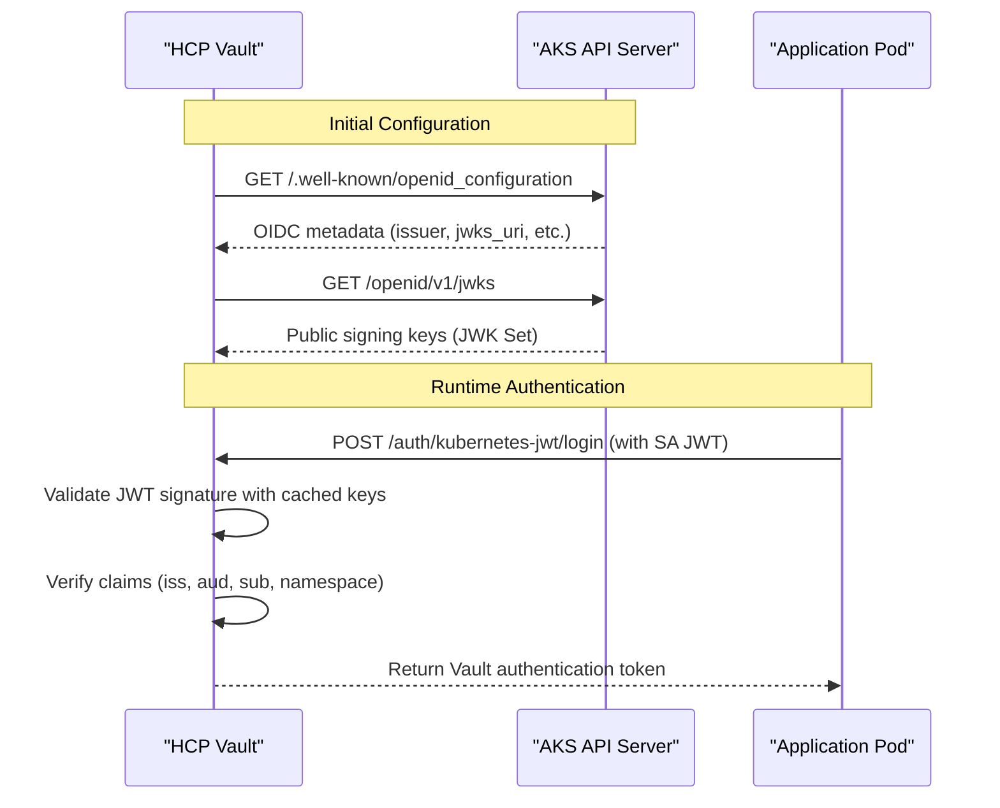

# OIDC Discovery Configuration for AKS Clusters

## What "Configure OIDC discovery pointing to your AKS cluster" Means

### **OIDC Discovery Endpoints**

When we say "configure OIDC discovery pointing to your AKS cluster," we mean telling HCP Vault where to find your AKS cluster's OIDC metadata.

### **Step 1: Find Your AKS Cluster's OIDC Discovery URL**

Your AKS cluster exposes OIDC discovery information at its API server endpoint:

```bash
# Get your AKS cluster's API server URL
kubectl config view --minify --output jsonpath='{.clusters[0].cluster.server}'
# Example output: https://myaks-cluster-12345678.hcp.eastus.azmk8s.io:443

# The OIDC discovery URL is the same URL + /.well-known/openid_configuration
# Full URL: https://myaks-cluster-12345678.hcp.eastus.azmk8s.io:443/.well-known/openid_configuration
```

### **Step 2: What the OIDC Discovery Endpoint Contains**

When you access the discovery endpoint, you get JSON metadata like this:

```bash
# Test the discovery endpoint
curl -k https://myaks-cluster-12345678.hcp.eastus.azmk8s.io:443/.well-known/openid_configuration
```

**Example Response:**
```json
{
  "issuer": "https://kubernetes.default.svc.cluster.local",
  "jwks_uri": "https://myaks-cluster-12345678.hcp.eastus.azmk8s.io:443/openid/v1/jwks",
  "response_types_supported": ["id_token"],
  "subject_types_supported": ["public"],
  "id_token_signing_alg_values_supported": ["RS256"],
  "claims_supported": [
    "aud",
    "exp",
    "iat",
    "iss",
    "kubernetes.io",
    "nbf",
    "sub"
  ]
}
```

### **Step 3: Configure HCP Vault to Use This Discovery**

Now you tell HCP Vault to use your AKS cluster's OIDC discovery:

```bash
# Enable JWT auth method in Vault
vault auth enable -path=kubernetes-jwt jwt

# Configure OIDC discovery - THIS IS THE KEY STEP
vault write auth/kubernetes-jwt/config \
    oidc_discovery_url="https://myaks-cluster-12345678.hcp.eastus.azmk8s.io:443" \
    oidc_discovery_ca_pem="$AKS_CA_CERTIFICATE" \
    bound_issuer="https://kubernetes.default.svc.cluster.local"
```

## **Real-World Example with Your AKS Cluster**

### **Finding Your Specific AKS Information**

```bash
#!/bin/bash
# get-aks-oidc-info.sh

echo "=== AKS OIDC Discovery Configuration ==="

# Get cluster API server URL
CLUSTER_URL=$(kubectl config view --minify --output jsonpath='{.clusters[0].cluster.server}')
echo "Cluster API Server: $CLUSTER_URL"

# Get cluster CA certificate
CLUSTER_CA=$(kubectl config view --raw --minify --flatten -o jsonpath='{.clusters[].cluster.certificate-authority-data}' | base64 -d)
echo "Cluster CA Certificate: [Base64 encoded - see below]"

# Test OIDC discovery endpoint
echo ""
echo "=== Testing OIDC Discovery Endpoint ==="
DISCOVERY_URL="${CLUSTER_URL}/.well-known/openid_configuration"
echo "Discovery URL: $DISCOVERY_URL"

echo ""
echo "Discovery Response:"
curl -k "$DISCOVERY_URL" 2>/dev/null | jq . || echo "Failed to fetch discovery info"

echo ""
echo "=== Vault Configuration Commands ==="
echo "# Enable JWT auth method"
echo "vault auth enable -path=kubernetes-jwt jwt"
echo ""
echo "# Configure OIDC discovery"
echo "vault write auth/kubernetes-jwt/config \\"
echo "    oidc_discovery_url=\"$CLUSTER_URL\" \\"
echo "    oidc_discovery_ca_pem=\"\$CLUSTER_CA\" \\"
echo "    bound_issuer=\"https://kubernetes.default.svc.cluster.local\""

echo ""
echo "=== Cluster CA Certificate (for oidc_discovery_ca_pem) ==="
echo "$CLUSTER_CA"
```

### **What Each Parameter Means**

1. **`oidc_discovery_url`**: Your AKS cluster's API server URL
   - Example: `https://myaks-cluster-12345678.hcp.eastus.azmk8s.io:443`
   - This tells Vault where to fetch OIDC configuration

2. **`oidc_discovery_ca_pem`**: The CA certificate for your AKS cluster
   - Used by Vault to verify the TLS connection to your cluster
   - Prevents man-in-the-middle attacks

3. **`bound_issuer`**: The expected issuer in JWT tokens
   - Usually: `https://kubernetes.default.svc.cluster.local`
   - This validates that tokens came from your specific cluster

### **How Vault Uses This Information**

Once configured, when a ServiceAccount JWT token is presented to Vault:

1. **Vault fetches OIDC config** from your AKS discovery URL
2. **Vault gets signing keys** from the JWKS endpoint
3. **Vault validates JWT signature** using the public keys
4. **Vault checks JWT claims** (issuer, audience, subject, etc.)
5. **Vault grants or denies access** based on role configuration

## **Visual Flow of OIDC Discovery**



## **Common AKS-Specific Configurations**

### **For AKS with Azure AD Integration**

```bash
# AKS with Azure AD might have different issuer
vault write auth/kubernetes-jwt/config \
    oidc_discovery_url="https://myaks-cluster.hcp.eastus.azmk8s.io:443" \
    oidc_discovery_ca_pem="$AKS_CA" \
    bound_issuer="https://sts.windows.net/your-tenant-id/"
```

### **For AKS with Workload Identity**

```bash
# AKS with Workload Identity enabled
vault write auth/kubernetes-jwt/config \
    oidc_discovery_url="https://myaks-cluster.hcp.eastus.azmk8s.io:443" \
    oidc_discovery_ca_pem="$AKS_CA" \
    bound_issuer="https://eastus.oic.prod-aks.azure.com/your-tenant-id/your-aks-oidc-issuer-id/"
```

## **Troubleshooting OIDC Discovery**

### **Common Issues and Solutions**

1. **Discovery endpoint not accessible**
```bash
# Test connectivity
curl -k https://your-aks-cluster:443/.well-known/openid_configuration

# If this fails, check:
# - Network connectivity from HCP Vault to your AKS cluster
# - AKS cluster's public API access settings
# - Firewall rules
```

2. **CA certificate issues**
```bash
# Verify CA certificate
openssl x509 -in cluster-ca.pem -text -noout

# Test TLS connection
openssl s_client -connect your-aks-cluster:443 -CAfile cluster-ca.pem
```

3. **Issuer mismatch**
```bash
# Check what issuer your cluster uses
kubectl create token default --audience=vault | jwt decode -

# Look for the "iss" claim in the output
```

## **Security Considerations**

### **Network Access Requirements**

- HCP Vault needs HTTPS access to your AKS API server
- Port 443/6443 must be accessible from HCP Vault's network
- Consider using private endpoints for enhanced security

### **Certificate Validation**

- Always provide the CA certificate (`oidc_discovery_ca_pem`)
- Never use `oidc_discovery_insecure_skip_verify=true` in production
- Regularly rotate certificates as part of cluster maintenance

### **Audience Binding**

- Always configure `bound_audiences` in JWT roles
- Use specific audiences like "vault" rather than generic ones
- This prevents JWT token reuse across different services

## **Example: Complete AKS OIDC Setup Script**

```bash
#!/bin/bash
# setup-aks-oidc-vault.sh

set -euo pipefail

echo "Setting up AKS OIDC authentication with HCP Vault..."

# Get AKS cluster information
CLUSTER_URL=$(kubectl config view --minify --output jsonpath='{.clusters[0].cluster.server}')
CLUSTER_CA=$(kubectl config view --raw --minify --flatten -o jsonpath='{.clusters[].cluster.certificate-authority-data}' | base64 -d)

echo "AKS Cluster URL: $CLUSTER_URL"

# Test OIDC discovery
echo "Testing OIDC discovery endpoint..."
DISCOVERY_RESPONSE=$(curl -s -k "${CLUSTER_URL}/.well-known/openid_configuration")
if echo "$DISCOVERY_RESPONSE" | jq -e '.issuer' > /dev/null; then
    echo "✅ OIDC discovery endpoint is accessible"
    ISSUER=$(echo "$DISCOVERY_RESPONSE" | jq -r '.issuer')
    echo "Detected issuer: $ISSUER"
else
    echo "❌ OIDC discovery endpoint is not accessible"
    exit 1
fi

# Configure Vault JWT auth
echo "Configuring Vault JWT authentication..."

vault auth enable -path=kubernetes-jwt jwt

vault write auth/kubernetes-jwt/config \
    oidc_discovery_url="$CLUSTER_URL" \
    oidc_discovery_ca_pem="$CLUSTER_CA" \
    bound_issuer="$ISSUER"

echo "✅ HCP Vault configured to use AKS OIDC discovery"
echo "Next steps:"
echo "1. Create JWT roles for your service accounts"
echo "2. Update VaultAuth resources to use 'kubernetes-jwt' mount"
echo "3. Test authentication with a sample application"
```

This script automates the entire OIDC discovery configuration process for your AKS cluster!