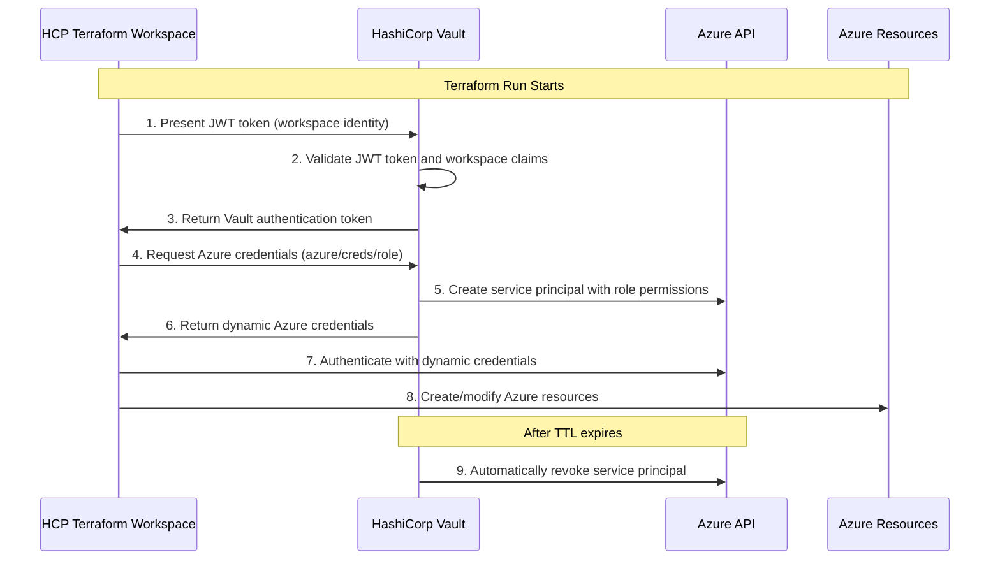

# HCP Terraform with Vault Dynamic Azure Credentials - User Guide

## Overview

This user guide provides a comprehensive overview of integrating HCP Terraform with HashiCorp Vault to use dynamic Azure credentials for infrastructure deployment. This integration eliminates the need for static service principal secrets and provides enhanced security through short-lived, automatically rotated credentials.

## Table of Contents

1. [What is HCP Terraform Vault Integration?](#what-is-hcp-terraform-vault-integration)
2. [Key Benefits](#key-benefits)
3. [How It Works](#how-it-works)
4. [Architecture Overview](#architecture-overview)
5. [Prerequisites](#prerequisites)
6. [Quick Start Guide](#quick-start-guide)
7. [Configuration Overview](#configuration-overview)
8. [Usage Examples](#usage-examples)
9. [Security Features](#security-features)
10. [Troubleshooting](#troubleshooting)
11. [Best Practices](#best-practices)
12. [Next Steps](#next-steps)

## What is HCP Terraform Vault Integration?

The HCP Terraform Vault integration allows your Terraform Cloud workspaces to authenticate with HashiCorp Vault and retrieve dynamic Azure credentials on-demand. Instead of storing static Azure service principal credentials in your workspace, Vault generates fresh, short-lived credentials for each Terraform run.

> **Important**: This integration is specifically designed for HCP Terraform Cloud and uses a different approach than the general HashiCorp validated pattern for CI/CD-Vault integration. For a detailed comparison of the differences, see [JWT Integration Comparison](../comparisons/jwt-integration-comparison.md).

### Key Components

- **HCP Terraform**: HashiCorp's managed Terraform Cloud service
- **HashiCorp Vault**: Centralized secrets management platform
- **Azure Secrets Engine**: Vault's capability to generate dynamic Azure credentials
- **JWT Authentication**: Secure authentication method for HCP Terraform workspaces

## Key Benefits

### 🔐 **Enhanced Security**
- **No Static Secrets**: Eliminates long-lived Azure credentials from your workspaces
- **Short-lived Credentials**: Default 1-hour TTL with automatic cleanup
- **Automatic Rotation**: Credentials are automatically generated and revoked
- **Complete Audit Trail**: All credential access is logged in Vault

### 🏗️ **Operational Excellence**
- **Centralized Management**: Single source of truth for Azure access
- **Workspace Isolation**: Each workspace can have different permissions
- **Easy Scaling**: Add new workspaces without managing additional secrets
- **Compliance Ready**: Built-in audit logging and access controls

### 🚀 **Developer Experience**
- **Seamless Integration**: Works with existing Terraform configurations
- **Automatic Authentication**: No manual credential management
- **Multiple Environments**: Easy setup for dev/staging/prod workflows
- **Rich Examples**: Complete examples and documentation

## How It Works



### Step-by-Step Process

1. **Workspace Identity**: HCP Terraform provides a JWT token containing workspace identity
2. **Vault Authentication**: Vault validates the JWT and returns an access token
3. **Credential Request**: Terraform requests Azure credentials from Vault
4. **Dynamic Generation**: Vault creates a new Azure service principal with specific permissions
5. **Resource Deployment**: Terraform uses the credentials to deploy Azure resources
6. **Automatic Cleanup**: Vault automatically revokes the credentials after TTL expires

## Architecture Overview

### High-Level Architecture

```
┌─────────────────────────────────────────────────────────────┐
│                    HCP Terraform                            │
│  ┌─────────────────┐  ┌─────────────────┐  ┌──────────────┐ │
│  │   Dev Workspace │  │Staging Workspace│  │Prod Workspace│ │
│  └─────────────────┘  └─────────────────┘  └──────────────┘ │
└─────────────────────────────────────────────────────────────┘
                                │
                                │ JWT Authentication
                                ▼
┌─────────────────────────────────────────────────────────────┐
│                 HashiCorp Vault                             │
│  ┌─────────────────┐  ┌─────────────────┐  ┌──────────────┐ │
│  │  JWT Auth       │  │  Azure Secrets  │  │   Policies   │ │
│  │  Backend        │  │  Engine         │  │  & Roles     │ │
│  └─────────────────┘  └─────────────────┘  └──────────────┘ │
└─────────────────────────────────────────────────────────────┘
                                │
                                │ Dynamic Credentials
                                ▼
┌─────────────────────────────────────────────────────────────┐
│                      Azure                                  │
│  ┌─────────────────┐  ┌─────────────────┐  ┌──────────────┐ │
│  │ Service         │  │ Resource        │  │ Networking   │ │
│  │ Principals      │  │ Groups          │  │ & Security   │ │
│  └─────────────────┘  └─────────────────┘  └──────────────┘ │
└─────────────────────────────────────────────────────────────┘
```

### Security Model

- **Authentication**: JWT tokens prove workspace identity
- **Authorization**: Vault policies control access to Azure credentials
- **Credential Lifecycle**: Short-lived credentials with automatic cleanup
- **Audit Trail**: Complete logging of all authentication and credential access

## Prerequisites

### Required Access and Tools

1. **HashiCorp Vault**:
   - HCP Vault cluster or self-hosted Vault (v1.12+)
   - Admin access to configure authentication and secrets engines
   - Azure secrets engine enabled and configured

2. **HCP Terraform**:
   - HCP Terraform organization
   - Workspace creation permissions
   - API token with appropriate permissions

3. **Azure**:
   - Azure subscription with Contributor or Owner permissions
   - Service principal for Vault Azure integration
   - Azure CLI for initial setup

4. **Local Tools**:
   - Vault CLI (v1.12+)
   - Terraform CLI (v1.0+)
   - Azure CLI (v2.40+)

### Environment Setup

Before starting, set these environment variables:

```bash
# Vault Configuration
export VAULT_ADDR="https://your-vault-cluster.vault.hashicorp.cloud:8200"
export VAULT_TOKEN="your-vault-admin-token"
export VAULT_NAMESPACE="admin"  # For HCP Vault

# Azure Configuration
export AZURE_SUBSCRIPTION_ID="12345678-1234-1234-1234-123456789012"
export AZURE_TENANT_ID="87654321-4321-4321-4321-210987654321"

# HCP Terraform Configuration
export HCP_TERRAFORM_TOKEN="your-hcp-terraform-token"
```

## Quick Start Guide

### Step 1: Run the Setup Script

The fastest way to get started is using our automated setup script:

```bash
# Navigate to the scripts directory
cd scripts/

# Run the setup script for your organization and workspace
./hcp-terraform-vault-setup.sh \
  --organization "your-hcp-org" \
  --workspace "azure-infrastructure"

# For production with custom settings
./hcp-terraform-vault-setup.sh \
  --organization "your-hcp-org" \
  --workspace "production-azure" \
  --role "terraform-prod" \
  --ttl "30m" \
  --max-ttl "2h"
```

### Step 2: Configure HCP Terraform Workspace

1. **Create or navigate to your workspace** in the HCP Terraform UI
2. **Set environment variables**:
   ```
   VAULT_ADDR = "https://your-vault-cluster.vault.hashicorp.cloud:8200"
   VAULT_NAMESPACE = "admin"
   ARM_SUBSCRIPTION_ID = "your-subscription-id"
   ARM_TENANT_ID = "your-tenant-id"
   ```

3. **Set Terraform variables**:
   ```hcl
   environment = "dev"
   project_name = "myproject"
   azure_region = "East US"
   ```

### Step 3: Use the Example Configuration

Copy the [basic deployment example](../examples/hcp-terraform/basic-deployment/) to your workspace:

```hcl
# Configure Vault provider with JWT authentication
provider "vault" {
  address   = var.vault_addr
  namespace = var.vault_namespace
  
  auth_login_jwt {
    role  = "hcp-terraform-azure"
    mount = "hcp_terraform"
  }
}

# Get dynamic Azure credentials
data "vault_generic_secret" "azure_creds" {
  path = "azure/creds/hcp-terraform"
}

# Configure Azure provider with dynamic credentials
provider "azurerm" {
  features {}
  
  subscription_id = var.azure_subscription_id
  tenant_id       = var.azure_tenant_id
  client_id       = data.vault_generic_secret.azure_creds.data["client_id"]
  client_secret   = data.vault_generic_secret.azure_creds.data["client_secret"]
}
```

### Step 4: Deploy Your Infrastructure

1. **Run `terraform plan`** to verify the configuration
2. **Run `terraform apply`** to deploy your resources
3. **Monitor the run** in both HCP Terraform and Vault audit logs

## Configuration Overview

### Vault Configuration

The setup script automatically configures:

- **JWT Authentication Backend**: Validates HCP Terraform workspace identity
- **Azure Role**: Defines permissions for dynamic credentials
- **Vault Policy**: Controls access to Azure credentials
- **JWT Role**: Maps workspace identity to Vault permissions

### HCP Terraform Workspace Variables

#### Required Environment Variables

| Variable | Description | Example |
|----------|-------------|---------|
| `VAULT_ADDR` | Vault server URL | `https://vault-cluster.vault.hashicorp.cloud:8200` |
| `VAULT_NAMESPACE` | Vault namespace | `admin` |
| `ARM_SUBSCRIPTION_ID` | Azure subscription ID | `12345678-1234-1234-1234-123456789012` |
| `ARM_TENANT_ID` | Azure tenant ID | `87654321-4321-4321-4321-210987654321` |

#### Common Terraform Variables

| Variable | Description | Default | Options |
|----------|-------------|---------|---------|
| `environment` | Environment name | `dev` | `dev`, `staging`, `prod` |
| `project_name` | Project identifier | `vaultdemo` | Any lowercase string |
| `azure_region` | Azure region | `East US` | Any valid Azure region |

### Credential Configuration

- **Default TTL**: 1 hour
- **Maximum TTL**: 4 hours
- **Azure Role**: Contributor (configurable)
- **Scope**: Subscription-level (configurable)

## Usage Examples

### Basic Resource Deployment

```hcl
# Create a resource group
resource "azurerm_resource_group" "main" {
  name     = "${var.project_name}-${var.environment}-rg"
  location = var.azure_region
  
  tags = {
    Environment      = var.environment
    ManagedBy       = "HCP-Terraform"
    CredentialSource = "Vault-Dynamic"
  }
}

# Create a storage account
resource "azurerm_storage_account" "main" {
  name                     = "${var.project_name}${var.environment}storage"
  resource_group_name      = azurerm_resource_group.main.name
  location                = azurerm_resource_group.main.location
  account_tier            = "Standard"
  account_replication_type = "LRS"
  
  tags = azurerm_resource_group.main.tags
}
```

### Multi-Environment Setup

#### Development Environment
```hcl
# Development workspace variables
environment = "dev"
azure_region = "East US"
# Longer TTL for development
vault_azure_role_ttl = "2h"
```

#### Production Environment
```hcl
# Production workspace variables
environment = "prod"
azure_region = "West US 2"
# Shorter TTL for production security
vault_azure_role_ttl = "30m"
```

### Monitoring Credential Usage

```bash
# Monitor Vault integration
./scripts/monitor-hcp-terraform-vault.sh

# Check active credentials
vault list sys/leases/lookup/azure/creds/hcp-terraform

# View workspace authentication
vault read auth/hcp_terraform/role/hcp-terraform-azure
```

## Security Features

### Authentication Security

- **JWT Token Validation**: Vault validates workspace identity claims
- **Workspace Binding**: Tokens are bound to specific organizations and workspaces
- **Short-lived Authentication**: Auth tokens expire after 1-2 hours

### Credential Security

- **Dynamic Generation**: Fresh credentials for each run
- **Configurable TTL**: 15 minutes to 24 hours (default: 1 hour)
- **Automatic Revocation**: Credentials are automatically cleaned up
- **Least Privilege**: Azure roles have minimal required permissions

### Access Control

- **Policy-based Access**: Vault policies control credential access
- **Environment Isolation**: Different roles for dev/staging/prod
- **Audit Logging**: Complete audit trail of all operations

### Network Security

- **TLS Encryption**: All communication encrypted in transit
- **Private Endpoints**: Support for Azure Private Link
- **IP Restrictions**: Configurable IP allowlists

## Troubleshooting

### Common Issues

#### 1. JWT Authentication Failed
```
Error: failed to login to Vault: unable to complete JWT authentication
```

**Solutions**:
- Verify `VAULT_ADDR` and `VAULT_NAMESPACE` are correct
- Check JWT role configuration: `vault read auth/hcp_terraform/role/hcp-terraform-azure`
- Ensure workspace name matches bound claims

#### 2. Azure Provider Authentication Failed
```
Error: building AzureRM Client: obtain subscription() from Azure CLI
```

**Solutions**:
- Test credential generation: `vault read azure/creds/hcp-terraform`
- Verify Azure subscription and tenant IDs
- Check Azure secrets engine configuration: `vault read azure/config`

#### 3. Permission Denied
```
Error: authorization failed: this request requires "Microsoft.Resources/resourceGroups/write"
```

**Solutions**:
- Review Azure role permissions: `vault read azure/roles/hcp-terraform`
- Check subscription-level access
- Verify resource group creation permissions

### Debugging Steps

1. **Enable Debug Logging**:
   ```bash
   # In HCP Terraform workspace
   TF_LOG = "DEBUG"
   VAULT_LOG_LEVEL = "DEBUG"
   ```

2. **Test Components Individually**:
   ```bash
   # Test Vault connectivity
   vault status
   
   # Test JWT authentication
   vault read auth/hcp_terraform/config
   
   # Test credential generation
   vault read azure/creds/hcp-terraform
   ```

3. **Check Audit Logs**:
   - Review Vault audit logs for authentication events
   - Check HCP Terraform run logs for detailed errors

## Best Practices

### Security Best Practices

1. **Use Short TTLs**:
   - Development: 1-2 hours
   - Production: 15-30 minutes

2. **Implement Least Privilege**:
   - Create environment-specific Azure roles
   - Use resource group-scoped permissions where possible

3. **Monitor Usage**:
   - Set up alerts for authentication failures
   - Monitor unusual credential generation patterns

### Operational Best Practices

1. **Environment Separation**:
   ```bash
   # Separate workspaces for each environment
   dev-azure-infrastructure
   staging-azure-infrastructure
   prod-azure-infrastructure
   ```

2. **Consistent Tagging**:
   ```hcl
   tags = {
     Environment       = var.environment
     ManagedBy        = "HCP-Terraform"
     CredentialSource = "Vault-Dynamic"
     Project          = var.project_name
   }
   ```

3. **Regular Maintenance**:
   - Review and rotate Vault service principal credentials monthly
   - Update Terraform provider versions regularly
   - Monitor and optimize credential TTLs

### Development Best Practices

1. **Start with Examples**:
   - Use the provided basic deployment example
   - Test in development environment first

2. **Version Control**:
   - Store Terraform configurations in Git
   - Use workspace-specific tfvars files

3. **Testing**:
   - Test credential generation manually before deployment
   - Implement proper error handling in Terraform configurations

## Next Steps

### Immediate Actions

1. **Set Up Development Environment**:
   - Run the setup script for a development workspace
   - Deploy the basic example to verify functionality

2. **Configure Additional Environments**:
   - Set up staging and production workspaces
   - Configure appropriate TTLs and permissions

3. **Implement Monitoring**:
   - Set up alerts for authentication failures
   - Monitor credential usage patterns

### Advanced Configuration

1. **Custom Azure Roles**:
   - Create environment-specific roles with minimal permissions
   - Implement resource group-scoped access

2. **Multi-Subscription Support**:
   - Configure roles for different Azure subscriptions
   - Implement cross-subscription resource deployment

3. **Integration with CI/CD**:
   - Integrate with GitHub Actions or other CI/CD systems
   - Implement automated testing and validation

### Resources and Support

- **[Complete Setup Guide](../docs/setup-guides/09-hcp-terraform-vault-integration.md)**: Detailed technical documentation
- **[Example Configurations](../examples/hcp-terraform/)**: Ready-to-use Terraform examples
- **[Troubleshooting Guide](../docs/setup-guides/09-hcp-terraform-vault-integration.md#troubleshooting)**: Common issues and solutions
- **[HCP Terraform Documentation](https://developer.hashicorp.com/terraform/cloud-docs)**: Official HCP Terraform docs
- **[Vault Documentation](https://www.vaultproject.io/docs)**: Official Vault documentation

## Conclusion

The HCP Terraform Vault integration provides a secure, scalable solution for managing Azure credentials in your infrastructure deployment workflows. By eliminating static secrets and providing dynamic, short-lived credentials, this integration significantly enhances your security posture while maintaining operational simplicity.

Start with the basic example in a development environment, then gradually expand to staging and production with appropriate security controls. The comprehensive documentation, examples, and monitoring tools provided will help ensure a successful implementation.

For additional support or questions, refer to the detailed setup guide or contact your HashiCorp support team.