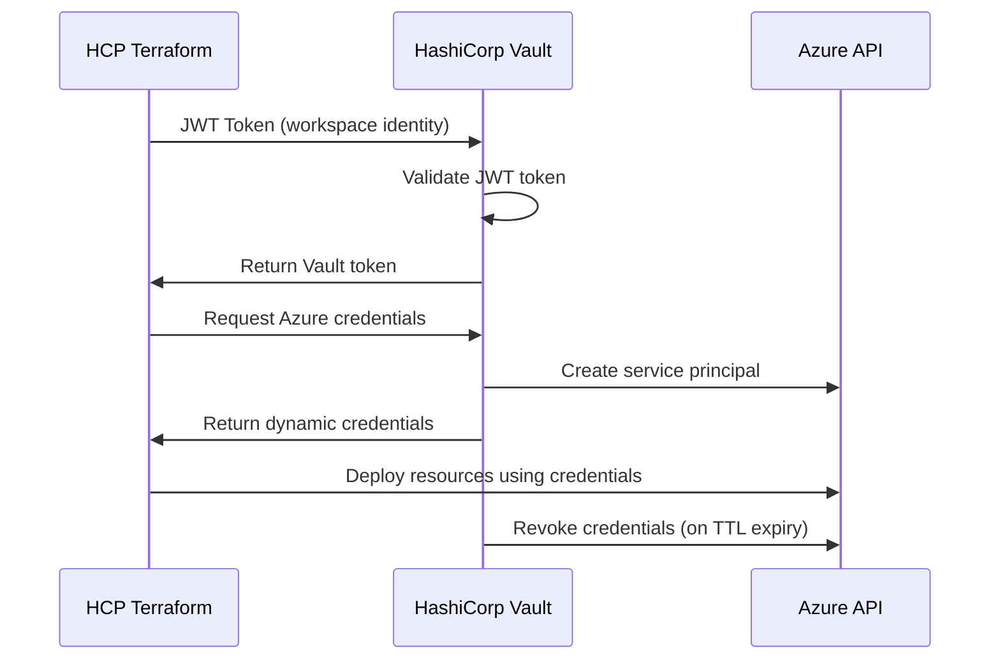

# HCP Terraform with Vault Dynamic Azure Credentials

This directory contains example configurations for using HCP Terraform with Vault dynamic Azure credentials.

## Overview

This example demonstrates how to:
- Authenticate HCP Terraform to Vault using JWT tokens
- Retrieve dynamic Azure credentials from Vault
- Use those credentials to provision Azure infrastructure
- Implement security best practices for credential management

## Directory Structure

```
examples/hcp-terraform/
├── README.md                    # This file
├── workspace-configuration/     # HCP Terraform workspace setup
│   ├── terraform.tfvars.example
│   └── workspace-variables.md
├── basic-deployment/           # Simple Azure resource deployment
│   ├── main.tf
│   ├── variables.tf
│   ├── outputs.tf
│   └── terraform.tfvars.example
├── advanced-deployment/        # Complex multi-service deployment
│   ├── main.tf
│   ├── variables.tf
│   ├── outputs.tf
│   ├── network.tf
│   ├── compute.tf
│   └── storage.tf
└── monitoring/                 # Monitoring and alerting
    ├── dashboard.json
    └── alerts.tf
```

## Prerequisites

Before using these examples, ensure you have:

1. **Vault Configuration**:
   - Vault cluster with Azure secrets engine enabled
   - HCP Terraform JWT authentication configured
   - Azure role created for dynamic credentials

2. **HCP Terraform Setup**:
   - HCP Terraform organization and workspace
   - Workspace configured with required variables
   - VCS integration (optional)

3. **Azure Prerequisites**:
   - Azure subscription with appropriate permissions
   - Service principal for Vault Azure integration
   - Resource groups and networking (if required)

## Quick Start

### 1. Run Setup Script

First, configure Vault for HCP Terraform integration:

```bash
# Navigate to scripts directory
cd scripts/

# Run the setup script
./hcp-terraform-vault-setup.sh --organization "your-org" --workspace "azure-infrastructure"

# Or run with custom configuration
./hcp-terraform-vault-setup.sh \
  --organization "your-org" \
  --workspace "production-azure" \
  --role "terraform-deployer" \
  --ttl "2h" \
  --max-ttl "8h"
```

### 2. Configure HCP Terraform Workspace

Set these variables in your HCP Terraform workspace:

**Environment Variables**:
```bash
VAULT_ADDR=https://your-vault-cluster.vault.hashicorp.cloud:8200
VAULT_NAMESPACE=admin
ARM_SUBSCRIPTION_ID=your-azure-subscription-id
ARM_TENANT_ID=your-azure-tenant-id
```

**Terraform Variables**:
```hcl
environment = "dev"
project_name = "vaultdemo"
azure_region = "East US"
```

### 3. Deploy Basic Example

1. Copy the `basic-deployment/` configuration to your HCP Terraform workspace
2. Configure the workspace variables as shown above
3. Run `terraform plan` and `terraform apply`

## Security Model

### Authentication Flow



### Security Features

- **No Static Secrets**: All Azure credentials are dynamically generated
- **Short-lived Credentials**: Default TTL of 1 hour, maximum 4 hours
- **Workspace Isolation**: Each workspace can have its own Azure role and permissions
- **Audit Trail**: Complete audit log of all credential requests and usage
- **Automatic Cleanup**: Credentials are automatically revoked when TTL expires
- **Least Privilege**: Azure roles have minimal required permissions

## Monitoring and Troubleshooting

### Monitor Credential Usage

```bash
# Check Vault credential usage
./scripts/monitor-hcp-terraform-vault.sh

# View active leases
vault list sys/leases/lookup/azure/creds/hcp-terraform

# Check workspace authentication
vault read auth/hcp_terraform/role/hcp-terraform-azure
```

### Common Issues

1. **Authentication Failed**
   ```
   Error: failed to login to Vault: unable to complete JWT authentication
   ```
   - Check workspace variables are set correctly
   - Verify JWT role configuration in Vault
   - Ensure workspace name matches bound claims

2. **Azure Provider Authentication**
   ```
   Error: building AzureRM Client: obtain subscription() from Azure CLI
   ```
   - Verify dynamic credentials are being retrieved
   - Check Azure role permissions
   - Validate subscription and tenant IDs

3. **Permission Denied**
   ```
   Error: authorization failed: this request requires "Microsoft.Resources/resourceGroups/write"
   ```
   - Review Azure role permissions in Vault
   - Check subscription-level access
   - Verify resource group creation permissions

### Debugging Steps

1. **Enable Vault Debug Logging**:
   ```bash
   export VAULT_LOG_LEVEL=debug
   ```

2. **Test Credential Generation Manually**:
   ```bash
   vault read azure/creds/hcp-terraform
   ```

3. **Verify JWT Authentication**:
   ```bash
   vault read auth/hcp_terraform/config
   vault read auth/hcp_terraform/role/hcp-terraform-azure
   ```

## Best Practices

### Workspace Configuration

1. **Use Environment-Specific Workspaces**:
   - `dev-azure-infrastructure`
   - `staging-azure-infrastructure`
   - `prod-azure-infrastructure`

2. **Configure Appropriate TTLs**:
   - Development: 1-2 hours
   - Staging: 2-4 hours
   - Production: 30 minutes - 1 hour

3. **Implement Proper Tagging**:
   ```hcl
   tags = {
     Environment      = var.environment
     ManagedBy       = "HCP-Terraform"
     CredentialSource = "Vault-Dynamic"
     Project         = var.project_name
     Owner           = var.team_name
   }
   ```

### Security Considerations

1. **Network Security**:
   - Use private endpoints for Vault where possible
   - Implement network security groups
   - Enable Azure Private Link

2. **Access Control**:
   - Use workspace-specific Azure roles
   - Implement least privilege permissions
   - Regular access reviews

3. **Monitoring**:
   - Enable Vault audit logging
   - Monitor credential generation patterns
   - Set up alerts for authentication failures

## Examples

### Basic Resource Group and Storage

See `basic-deployment/` for a simple example that creates:
- Azure Resource Group
- Storage Account
- Basic networking

### Advanced Multi-Service Deployment

See `advanced-deployment/` for a complex example that includes:
- Virtual Network with subnets
- Network Security Groups
- Virtual Machines
- Load Balancer
- Key Vault integration
- Monitoring and logging

## Support and Documentation

- [HashiCorp Vault Documentation](https://www.vaultproject.io/docs)
- [HCP Terraform Documentation](https://developer.hashicorp.com/terraform/cloud-docs)
- [Azure Provider Documentation](https://registry.terraform.io/providers/hashicorp/azurerm/latest/docs)
- [Vault Azure Secrets Engine](https://www.vaultproject.io/docs/secrets/azure)

## Contributing

When adding new examples:

1. Follow the established directory structure
2. Include comprehensive documentation
3. Add appropriate error handling
4. Implement proper resource tagging
5. Include monitoring and logging
6. Test with different Azure regions and environments

## License

This example is provided as-is for educational and demonstration purposes.